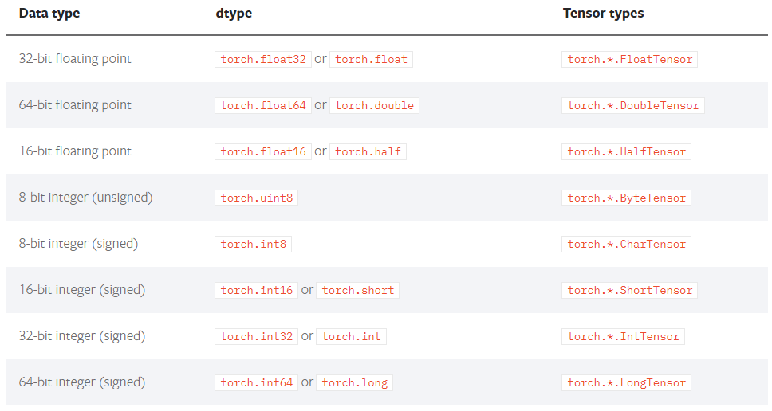

# Pytorch的入门使用

## 目标

1. 知道张量和Pytorch中的张量
2. 知道pytorch中如何创建张量
3. 知道pytorch中tensor的常见方法
4. 知道pytorch中tensor的数据类型
5. 知道pytorch中如何实现tensor在cpu和cuda中转化


## 1. 张量Tensor

张量是一个统称，其中包含很多类型：

1. 0阶张量：标量、常数，0-D Tensor
2. 1阶张量：向量，1-D Tensor
3. 2阶张量：矩阵，2-D Tensor
4. 3阶张量
5. ...
6. N阶张量


## 2. Pytorch中创建张量

1. 使用python中的列表或者序列创建tensor

   ```python
   torch.tensor([[1., -1.], [1., -1.]])
   tensor([[ 1.0000, -1.0000],
           [ 1.0000, -1.0000]])
   ```

2. 使用numpy中的数组创建tensor

   ```python
   torch.tensor(np.array([[1, 2, 3], [4, 5, 6]]))
   tensor([[ 1,  2,  3],
           [ 4,  5,  6]])
   ```

3. 使用torch的api创建tensor

   1. `torch.empty(3,4)`创建3行4列的空的tensor，会用无用数据进行填充

   2. `torch.ones([3,4])` 创建3行4列的**全为1**的tensor

   3. `torch.zeros([3,4])`创建3行4列的**全为0**的tensor

   4. `torch.rand([3,4])` 创建3行4列的**随机值**的tensor，随机值的区间是`[0, 1)`

      ```python
      >>> torch.rand(2, 3)
      tensor([[ 0.8237,  0.5781,  0.6879],
      [ 0.3816,  0.7249,  0.0998]])
      ```

   5. `torch.randint(low=0,high=10,size=[3,4])` 创建3行4列的**随机整数**的tensor，随机值的区间是`[low, high)`

      ```python
      >>> torch.randint(3, 10, (2, 2))
      tensor([[4, 5],
      	[6, 7]])
      ```

   6. `torch.randn([3,4])` 创建3行4列的**随机数**的tensor，随机值的分布式均值为0，方差为1

## 3. Pytorch中tensor的常用方法

1. 获取tensor中的数据(当tensor中只有一个元素可用)：`tensor.item()`

   ```python
   In [10]: a = torch.tensor(np.arange(1))
   
   In [11]: a
   Out[11]: tensor([0])
   
   In [12]: a.item()
   Out[12]: 0
   ```

2. 转化为numpy数组

   ```python
   In [55]: z.numpy()
   Out[55]:
   array([[-2.5871205],
          [ 7.3690367],
          [-2.4918075]], dtype=float32)
   ```

   

3. 获取形状：`tensor.size()`

   ```python
   In [72]: x
   Out[72]:
   tensor([[    1,     2],
           [    3,     4],
           [    5,    10]], dtype=torch.int32)
   
   In [73]: x.size()
   Out[73]: torch.Size([3, 2])
   ```

   

4. 形状改变：`tensor.view((3,4))`。类似numpy中的reshape，是一种浅拷贝，仅仅是形状发生改变

   ```python
   In [76]: x.view(2,3)
   Out[76]:
   tensor([[    1,     2,     3],
           [    4,     5,    10]], dtype=torch.int32)
   ```

   

5. 获取阶数：`tensor.dim()`

   ```python
   In [77]: x.dim()
   Out[77]: 2
   ```

   

6. 获取最大值：`tensor.max()`

   ```python
   In [78]: x.max()
   Out[78]: tensor(10, dtype=torch.int32)
   ```

   

7. 转置：`tensor.t()`

   ```python
   In [79]: x.t()
   Out[79]:
   tensor([[    1,     3,     5],
           [    2,     4, 	  10]], dtype=torch.int32)
   ```

8. `tensor[1,3]`  获取tensor中第一行第三列的值

9. `tensor[1,3]=100` 对tensor中第一行第三列的位置进行赋值100

10. tensor的切片

   ```python
   In [101]: x
   Out[101]:
   tensor([[1.6437, 1.9439, 1.5393],
           [1.3491, 1.9575, 1.0552],
           [1.5106, 1.0123, 1.0961],
           [1.4382, 1.5939, 1.5012],
           [1.5267, 1.4858, 1.4007]])
   
   In [102]: x[:,1]
   Out[102]: tensor([1.9439, 1.9575, 1.0123, 1.5939, 1.4858])
   ```

​    

## 4. tensor的数据类型

tensor中的数据类型非常多，常见类型如下：



上图中的Tensor types表示这种type的tensor是其实例


1. 获取tensor的数据类型:`tensor.dtype`

   ```python
   In [80]: x.dtype
   Out[80]: torch.int32
   ```

2. 创建数据的时候指定类型

   ```python
   In [88]: torch.ones([2,3],dtype=torch.float32)
   Out[88]:
   tensor([[9.1167e+18, 0.0000e+00, 7.8796e+15],
           [8.3097e-43, 0.0000e+00, -0.0000e+00]])
   ```

   

3. 类型的修改

   ```python
   In [17]: a
   Out[17]: tensor([1, 2], dtype=torch.int32)
   
   In [18]: a.type(torch.float)
   Out[18]: tensor([1., 2.])
   
   In [19]: a.double()
   Out[19]: tensor([1., 2.], dtype=torch.float64)
   ```

   


## 5. tensor的其他操作

1. tensor和tensor相加

   ```python
   In [94]: x = x.new_ones(5, 3, dtype=torch.float)
   
   In [95]: y = torch.rand(5, 3)
   
   In [96]: x+y
   Out[96]:
   tensor([[1.6437, 1.9439, 1.5393],
           [1.3491, 1.9575, 1.0552],
           [1.5106, 1.0123, 1.0961],
           [1.4382, 1.5939, 1.5012],
           [1.5267, 1.4858, 1.4007]])
   In [98]: torch.add(x,y)
   Out[98]:
   tensor([[1.6437, 1.9439, 1.5393],
           [1.3491, 1.9575, 1.0552],
           [1.5106, 1.0123, 1.0961],
           [1.4382, 1.5939, 1.5012],
           [1.5267, 1.4858, 1.4007]])
   In [99]: x.add(y)
   Out[99]:
   tensor([[1.6437, 1.9439, 1.5393],
           [1.3491, 1.9575, 1.0552],
           [1.5106, 1.0123, 1.0961],
           [1.4382, 1.5939, 1.5012],
           [1.5267, 1.4858, 1.4007]])
   In [100]: x.add_(y)  #带下划线的方法会对x进行就地修改
   Out[100]:
   tensor([[1.6437, 1.9439, 1.5393],
           [1.3491, 1.9575, 1.0552],
           [1.5106, 1.0123, 1.0961],
           [1.4382, 1.5939, 1.5012],
           [1.5267, 1.4858, 1.4007]])
   
   In [101]: x #x发生改变
   Out[101]:
   tensor([[1.6437, 1.9439, 1.5393],
           [1.3491, 1.9575, 1.0552],
           [1.5106, 1.0123, 1.0961],
           [1.4382, 1.5939, 1.5012],
           [1.5267, 1.4858, 1.4007]])
   ```

   注意：带下划线的方法（比如:`add_`)会对tensor进行就地修改

2. tensor和数字操作

   ```python
   In [97]: x +10
   Out[97]:
   tensor([[11., 11., 11.],
           [11., 11., 11.],
           [11., 11., 11.],
           [11., 11., 11.],
           [11., 11., 11.]])
   ```

3. CUDA中的tensor

   CUDA（Compute Unified Device Architecture），是NVIDIA推出的运算平台。 CUDA™是一种由NVIDIA推出的通用并行计算架构，该架构使GPU能够解决复杂的计算问题。

   `torch.cuda`这个模块增加了对CUDA tensor的支持，能够在cpu和gpu上使用相同的方法操作tensor

   通过`.to`方法能够把一个tensor转移到另外一个设备(比如从CPU转到GPU)

   ```python
   #device = torch.device("cuda:0" if torch.cuda.is_available() else "cpu")
   if torch.cuda.is_available():
       device = torch.device("cuda")          # cuda device对象
       y = torch.ones_like(x, device=device)  # 创建一个在cuda上的tensor
       x = x.to(device)                       # 使用方法把x转为cuda 的tensor
       z = x + y
       print(z)
       print(z.to("cpu", torch.double))       # .to方法也能够同时设置类型
       
   >>tensor([1.9806], device='cuda:0')
   >>tensor([1.9806], dtype=torch.float64)
   ```

   

通过前面的学习，可以发现torch的各种操作几乎和numpy一样