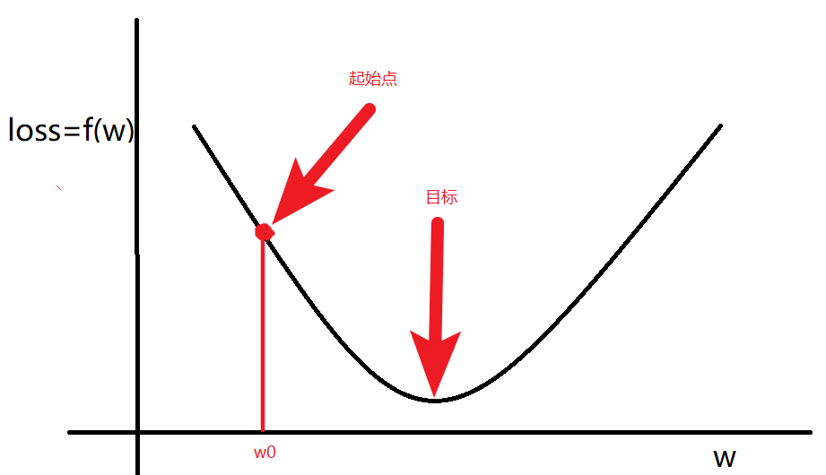
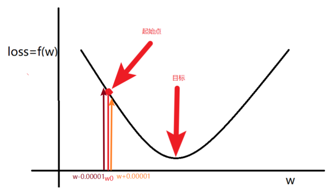
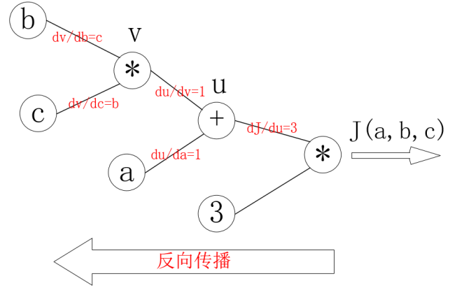
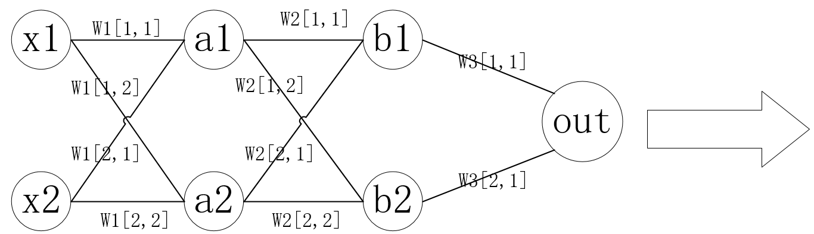
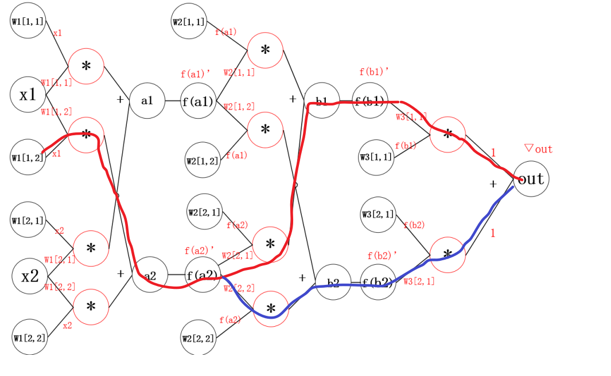
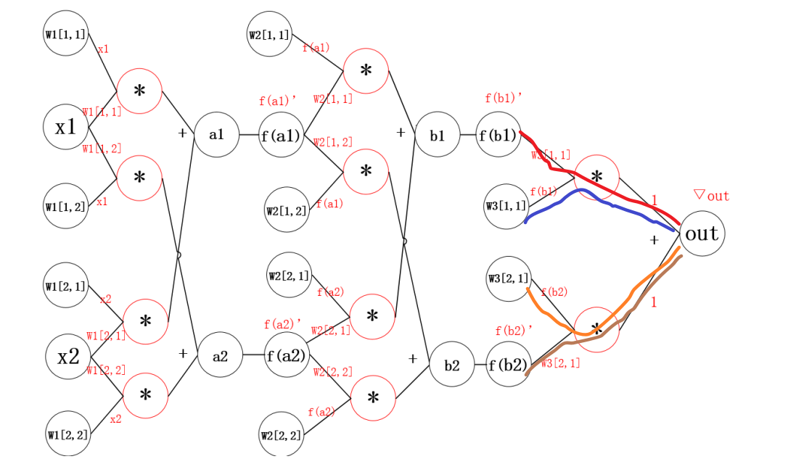
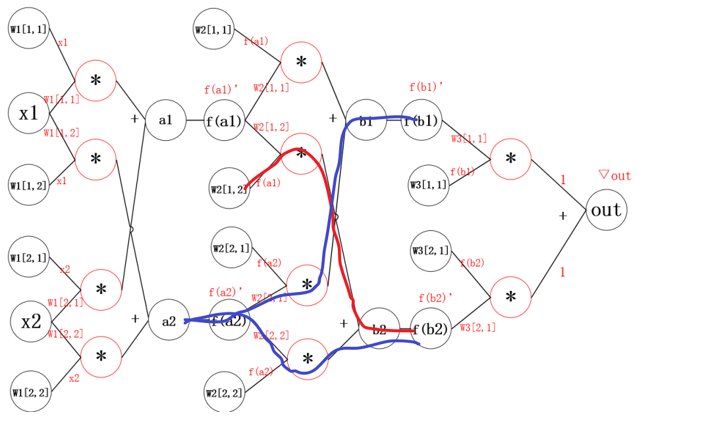

# 梯度下降和反向传播

## 目标

1. 知道什么是梯度下降
2. 知道什么是反向传播

## 1. 梯度是什么?

梯度：是一个向量，导数+变化最快的方向(学习的前进方向)

回顾机器学习

收集数据$x$ ，构建机器学习模型$f$，得到$f(x,w) = Y_{predict}​$

判断模型好坏的方法：
$$
\begin{align*}
loss & = (Y_{predict}-Y_{true})^2  &(回归损失) \\
loss & = Y_{true} \cdot log(Y_{predict}) &(分类损失)
\end{align*}
$$

目标：通过调整(学习)参数$w$，尽可能的降低$loss$，那么我们该如何调整$w$呢？

随机选择一个起始点$w_0$,通过调整$w_0$，让loss函数取到最小值

**$w​$的更新方法**：

1.  计算$w$的梯度（导数）

$$
\begin{align*}
\nabla w = \frac{f(w+0.000001)-f(w-0.000001)}{2*0.000001} 

\end{align*}
$$

2. 更新$w$
   $$
   w = w - \alpha \nabla w
   $$
   

其中：

1. $\nabla w <0 ​$ ,意味着w将增大
2. $\nabla w >0 $ ,意味着w将减小

总结：梯度就是多元函数参数的变化趋势（参数学习的方向），只有一个自变量时称为**导数**

## 2. 偏导的计算

### 2.1 常见的导数计算

- 多项式求导数：$f(x) = x^5​$ ,$f^{'}(x) = 5x^{(5-1)}​$

- 基本运算求导：$f(x) = xy​$ ，$f^{'}(x) = y​$

- 指数求导：$f(x) = 5e^x​$ ，$f^{'}(x) = 5e^x​$

- 对数求导：$f(x) = 5lnx​$ ，$f^{'}(x) = \frac{5}{x}​$，ln 表示log以e为底的对数

- 导数的微分形式：
  $$
  \begin{align*}
  & f^{'}(x) = & \frac{d f(x)}{dx} \\
  & 牛顿         &莱布尼兹
  \end{align*}
  $$
  

那么：如何求$f(x) = (1+e^{-x})^{-1}$ 的导数呢？那就可以使用

$f(x) = (1+e^{-x})^{-1}​$         ==>   $f(a) = a^{-1},a(b) = (1+b),b(c) = e^c,c(x) = -x​$

则有：
$$
\begin{align*}
\frac{d f(x)}{dx} & = \frac{df}{da} \times \frac{da}{db} \times \frac{db}{dc}\times \frac{dc}{dx} \\
&=-a^{-2} \times 1\times e^c \times (-1) \\
&= -(1+e^{-x})^{-2} \times e^{-x} \times (-1) \\
&= e^{-x}(1+e^{-x})^{-2}
\end{align*}
$$

### 2.2 多元函数求偏导

一元函数，即有一个自变量。类似$f(x)$

多元函数，即有多个自变量。类似$f(x,y,z),三个自变量x,y,z$

多元函数求偏导过程中：**对某一个自变量求导，其他自变量当做常量即可**

例1：
$$
\begin{align*}
 &f(x,y,z) &= &ax+by+cz \\
&\frac{df(x,y,z)}{dx} &= &a \\
&\frac{df(x,y,z)}{dy} &= &b \\
&\frac{df(x,y,z)}{dz} &= &c
\end{align*}
$$

例2：
$$
\begin{align*}
 &f(x,y) &= &xy \\
&\frac{df(x,y)}{dx} &= & y\\
&\frac{df(x,y)}{dy} &= &x 
\end{align*}
$$
例3：
$$
\begin{align*}
 &f(x,w) &= &(y-xw)^2 \\
&\frac{df(x,w)}{dx} &= & -2w(y-xw)\\
&\frac{df(x,w)}{dw} &= & -2x(y-xw)
\end{align*}
$$
**练习：**

已知$J(a,b,c) = 3(a+bc),令u=a+v,v = bc​$,求a，b，c各自的偏导数。
$$
\begin{align*}
 令:& J(a,b,c) = 3u\\
 \frac{dJ}{da} &=\frac{dJ}{du} \times \frac{du}{da} = 3\times1 \\
 \frac{dJ}{db} &=\frac{dJ}{du} \times \frac{du}{dv} \times \frac{dv}{db} = 3\times1\times c \\
 \frac{dJ}{dc} &=\frac{dJ}{du} \times \frac{du}{dv} \times \frac{dv}{dc} = 3\times1\times b \\
\end{align*}
$$

## 3. 反向传播算法

### 3.1 计算图和反向传播

计算图：通过图的方式来描述函数的图形

在上面的练习中，$J(a,b,c) = 3(a+bc),令u=a+v,v = bc$,把它绘制成计算图可以表示为：

绘制成为计算图之后，可以清楚的看到向前计算的过程

之后，对每个节点求偏导可有：

那么反向传播的过程就是一个上图的从右往左的过程，自变量$a,b,c$各自的偏导就是连线上的梯度的乘积：
$$
\begin{align*}
\frac{dJ}{da} &= 3 \times 1 \\
\frac{dJ}{db} &= 3 \times 1 \times c \\
\frac{dJ}{dc} &= 3 \times 1 \times b 
\end{align*}
$$

### 3.2 神经网络中的反向传播

#### 3.2.1 神经网络的示意图

$w1,w2,....wn​$表示网络第n层权重

$w_n[i,j]$表示第n层第i个神经元，连接到第n+1层第j个神经元的权重。

#### 3.2.2 神经网络的计算图

其中：

1. $\nabla out​$是根据损失函数对预测值进行求导得到的结果
2. f函数可以理解为激活函数

**问题：**那么此时$w_1[1,2]$的偏导该如何求解呢？

通过观察，发现从$out$ 到$w_1[1,2]$的来连接线有两条

结果如下：
$$
\frac{dout}{dW_1[1,2]} = x1*f^{'}(a2)*(W_2[2,1]*f^{'}(b1)*W_3[1,1]*\nabla out +W_2[2,2]*f^{'}(b2)*W_3[2,1]*\nabla out)
$$
公式分为两部分：

1. 括号外：左边红线部分
2. 括号内
   1. 加号左边：右边红线部分
   2. 加号右边：蓝线部分

但是这样做，当模型很大的时候，计算量非常大

所以反向传播的思想就是对其中的某一个参数单独求梯度，之后更新，如下图所示：

 

计算过程如下
$$
\begin{align*}
&\nabla W_3[1,1] = f(b_1)*\nabla out  & （计算W_3[1,1]梯度）\\
&\nabla W_3[2,1] = f(b_2)*\nabla out  & （计算W_3[2,1]梯度）\\
\\
&\nabla b_1= f^{'}(b_1)*W_3[1,1]*\nabla out  & （计算W_3[2,1]梯度）\\
&\nabla b_2= f^{'}(b_2)*W_3[2,1]*\nabla out  & （计算W_3[2,1]梯度）\\

\end{align*}
$$
更新参数之后，继续反向传播

计算过程如下：
$$
\begin{align*}
&\nabla W_2[1,2] = f(a_1)* \nabla b_2 \\
&\nabla a_2 = f^{'}(a_2)*(w_2[2,1]\nabla b_1 +W_2[2,2] \nabla b_2)
\end{align*}
$$
继续反向传播

计算过程如下：
$$
\begin{align*}
&▽W_1[1,2]= x_1*▽a_2\\
&▽x_1= (W_1[1,1]*▽a_1+w_1[1,2]*▽a_2)*x_1’
\end{align*}
$$

**通用的描述如下**
$$
\nabla w^{l}_{i,j} = f(a^l_i)* \nabla a^{i+1}_{j}\\
\nabla a^{l}_i = f'(a^l_i)*(\sum_{j=1}^{m}w_{i,j}*\nabla a_j^{l+1})
$$
