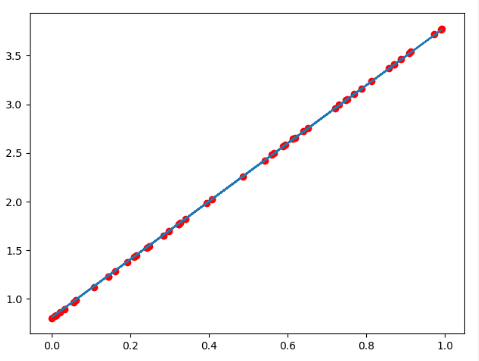

# Pytorch完成线性回归

## 目标

1. 知道`requires_grad`的作用
2. 知道如何使用`backward`
3. 知道如何手动完成线性回归

   


## 1. 向前计算

对于pytorch中的一个tensor，如果设置它的属性 `.requires_grad`为`True`，那么它将会追踪对于该张量的所有操作。或者可以理解为，这个tensor是一个参数，后续会被计算梯度，更新该参数。


### 1.1 计算过程

假设有以下条件（1/4表示求均值，xi中有4个数），使用torch完成其向前计算的过程
$$
\begin{align*}
&o = \frac{1}{4}\sum_iz_i \\
&z_i = 3(x_i+2)^2\\
其中:&\\
&z_i|_{x_i=1}=27\\
\end{align*}
$$
如果x为参数，需要对其进行梯度的计算和更新

那么，在最开始随机设置x的值的过程中，需要设置他的requires_grad属性为True，其**默认值为False**

```python
import torch
x = torch.ones(2, 2, requires_grad=True)  #初始化参数x并设置requires_grad=True用来追踪其计算历史
print(x)
#tensor([[1., 1.],
#        [1., 1.]], requires_grad=True)

y = x+2
print(y)
#tensor([[3., 3.],
#        [3., 3.]], grad_fn=<AddBackward0>)

z = y*y*3  #平方x3
print(x)
#tensor([[27., 27.],
#        [27., 27.]], grad_fn=<MulBackward0>) 

out = z.mean() #求均值
print(out)
#tensor(27., grad_fn=<MeanBackward0>)

```

从上述代码可以看出：

1. x的requires_grad属性为True
2. 之后的每次计算都会修改其`grad_fn`属性，用来记录做过的操作
   1. 通过这个函数和grad_fn能够组成一个和前一小节类似的计算图

### 1.2 requires_grad和grad_fn

```python
a = torch.randn(2, 2)
a = ((a * 3) / (a - 1))
print(a.requires_grad)  #False
a.requires_grad_(True)  #就地修改
print(a.requires_grad)  #True
b = (a * a).sum()
print(b.grad_fn) # <SumBackward0 object at 0x4e2b14345d21>
with torch.no_gard():
    c = (a * a).sum()  #tensor(151.6830),此时c没有gard_fn
    
print(c.requires_grad) #False
```

注意：

为了防止跟踪历史记录（和使用内存），可以将代码块包装在`with torch.no_grad():`中。**在评估模型时特别有用**，因为模型可能具有`requires_grad = True`的可训练的参数，但是我们不需要在此过程中对他们进行梯度计算。

## 2. 梯度计算

对于1.1 中的out而言，我们可以使用`backward`方法来进行反向传播，计算梯度

`out.backward()`,此时便能够求出导数$\frac{d out}{dx}$,调用`x.gard`能够获取导数值

得到

```python
tensor([[4.5000, 4.5000],
        [4.5000, 4.5000]])
```

 因为：
$$
\frac{d(O)}{d(x_i)} = \frac{3}{2}(x_i+2)
$$
在$x_i$等于1时其值为4.5


注意：在输出为一个标量的情况下，我们可以调用输出`tensor`的`backword()` 方法，但是在数据是一个向量的时候，调用`backward()`的时候还需要传入其他参数。

很多时候我们的损失函数都是一个标量，所以这里就不再介绍损失为向量的情况。


`loss.backward()`就是根据损失函数，对参数（requires_grad=True）的去计算他的梯度，并且把它累加保存到`x.gard`，此时还并未更新其梯度


注意点：

1. `tensor.data`:

   - 在tensor的require_grad=False，tensor.data和tensor等价

   - require_grad=True时，tensor.data仅仅是获取tensor中的数据

2. `tensor.numpy()`:

   - `require_grad=True`不能够直接转换，需要使用`tensor.detach().numpy()`


## 3. 线性回归实现

下面，我们使用一个自定义的数据，来使用torch实现一个简单的线性回归

假设我们的基础模型就是`y = wx+b`，其中w和b均为参数，我们使用`y = 3x+0.8`来构造数据x、y，所以最后通过模型应该能够得出w和b应该分别接近3和0.8

1. 准备数据
2. 计算预测值
3. 计算损失，把参数的梯度置为0，进行反向传播
4. 更新参数

```python
import torch
import numpy as np
from matplotlib import pyplot as plt


#1. 准备数据 y = 3x+0.8，准备参数
x = torch.rand([50])
y = 3*x + 0.8

w = torch.rand(1,requires_grad=True)
b = torch.rand(1,requires_grad=True)

def loss_fn(y,y_predict):
    loss = (y_predict-y).pow(2).mean()
    for i in [w,b]:
		#每次反向传播前把梯度置为0
        if i.grad is not None:
            i.grad.data.zero_()
    # [i.grad.data.zero_() for i in [w,b] if i.grad is not None]
    loss.backward()
    return loss.data

def optimize(learning_rate):
    # print(w.grad.data,w.data,b.data)
    w.data -= learning_rate* w.grad.data
    b.data -= learning_rate* b.grad.data

for i in range(3000):
    #2. 计算预测值
    y_predict = x*w + b
	
    #3.计算损失，把参数的梯度置为0，进行反向传播 
    loss = loss_fn(y,y_predict)
    
    if i%500 == 0:
        print(i,loss)
    #4. 更新参数w和b
    optimize(0.01)

# 绘制图形，观察训练结束的预测值和真实值
predict =  x*w + b  #使用训练后的w和b计算预测值

plt.scatter(x.data.numpy(), y.data.numpy(),c = "r")
plt.plot(x.data.numpy(), predict.data.numpy())
plt.show()

print("w",w)
print("b",b)
```


图形效果如下：



打印w和b，可有

```python
w tensor([2.9280], requires_grad=True)
b tensor([0.8372], requires_grad=True)
```

可知，w和b已经非常接近原来的预设的3和0.8


