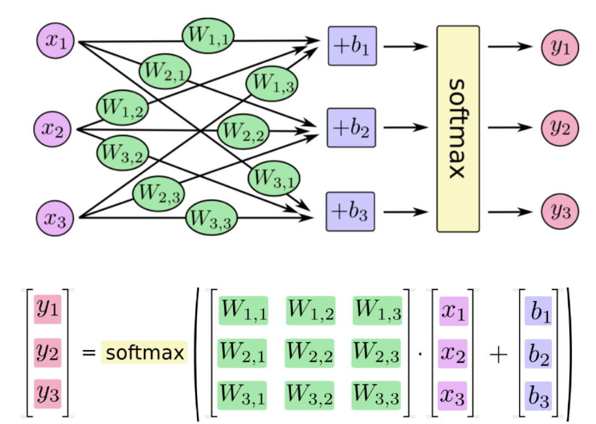

# 使用Pytorch实现手写数字识别

## 目标

1. 知道如何使用Pytorch完成神经网络的构建
2. 知道Pytorch中激活函数的使用方法
3. 知道Pytorch中`torchvision.transforms`中常见图形处理函数的使用
4. 知道如何训练模型和如何评估模型


## 1. 思路和流程分析

流程：

1. 准备数据，这些需要准备DataLoader
2. 构建模型，这里可以使用torch构造一个深层的神经网络
3. 模型的训练
4. 模型的保存，保存模型，后续持续使用
5. 模型的评估，使用测试集，观察模型的好坏

## 2. 准备训练集和测试集

准备数据集的方法前面已经讲过，但是通过前面的内容可知，调用MNIST返回的结果中图形数据是一个Image对象,需要对其进行处理

为了进行数据的处理，接下来学习`torchvision.transfroms`的方法

### 2.1 `torchvision.transforms`的图形数据处理方法

#### 2.1.1 `torchvision.transforms.ToTensor`

把一个取值范围是`[0,255]`的`PIL.Image`或者`shape`为`(H,W,C)`的`numpy.ndarray`，转换成形状为`[C,H,W]`

其中`(H,W,C)`意思为`(高，宽，通道数)`，黑白图片的通道数只有1，其中每个像素点的取值为[0,255],彩色图片的通道数为(R,G,B),每个通道的每个像素点的取值为[0,255]，三个通道的颜色相互叠加，形成了各种颜色

示例如下：

```python
from torchvision import transforms
import numpy as np

data = np.random.randint(0, 255, size=12)
img = data.reshape(2,2,3)
print(img.shape)
img_tensor = transforms.ToTensor()(img) # 转换成tensor
print(img_tensor)
print(img_tensor.shape)
```

输出如下：

```python
shape:(2, 2, 3)
img_tensor:tensor([[[215, 171],
                 [ 34,  12]],

                [[229,  87],
                 [ 15, 237]],

                [[ 10,  55],
                 [ 72, 204]]], dtype=torch.int32)
new shape:torch.Size([3, 2, 2])

```

注意：

`transforms.ToTensor`对象中有`__call__`方法，所以可以对其示例能够传入数据获取结果

#### 2.1.2 `torchvision.transforms.Normalize(mean, std)`

给定均值：mean，shape和图片的通道数相同(指的是每个通道的均值)，方差：std，和图片的通道数相同(指的是每个通道的方差)，将会把`Tensor`规范化处理。

即：`Normalized_image=(image-mean)/std`。

例如：

```python
from torchvision import transforms
import numpy as np
import torchvision

data = np.random.randint(0, 255, size=12)
img = data.reshape(2,2,3)
img = transforms.ToTensor()(img) # 转换成tensor
print(img)
print("*"*100)

norm_img = transforms.Normalize((10,10,10), (1,1,1))(img) #进行规范化处理

print(norm_img)
```

输出如下：

```
tensor([[[177, 223],
         [ 71, 182]],

        [[153, 120],
         [173,  33]],

        [[162, 233],
         [194,  73]]], dtype=torch.int32)
***************************************************************************************
tensor([[[167, 213],
         [ 61, 172]],

        [[143, 110],
         [163,  23]],

        [[152, 223],
         [184,  63]]], dtype=torch.int32)
```

注意：在sklearn中，默认上式中的std和mean为数据每列的std和mean，sklearn会在标准化之前算出每一列的std和mean。

但是在api：Normalize中并没有帮我们计算，所以我们需要手动计算

1. 当mean为全部数据的均值，std为全部数据的std的时候，才是进行了标准化。

2. 如果mean(x)不是全部数据的mean的时候，std(y)也不是的时候，Normalize后的数据分布满足下面的关系
   $$
   \begin{align*}
   &new\_mean = \frac{mean-x}{y}&， mean为原数据的均值，x为传入的均值x \\
   &new\_std = \frac{std}{y} &，y为传入的标准差y\\
   \end{align*}
   $$


#### 2.1.3 `torchvision.transforms.Compose(transforms)`

将多个`transform`组合起来使用。

例如


```python
transforms.Compose([
     torchvision.transforms.ToTensor(), #先转化为Tensor
     torchvision.transforms.Normalize(mean,std) #在进行正则化
 ])
```


### 2.2 准备MNIST数据集的Dataset和DataLoader

准备训练集

```python
import torchvision

#准备数据集，其中0.1307，0.3081为MNIST数据的均值和标准差，这样操作能够对其进行标准化
#因为MNIST只有一个通道（黑白图片）,所以元组中只有一个值
dataset = torchvision.datasets.MNIST('/data', train=True, download=True,
                             transform=torchvision.transforms.Compose([
                               torchvision.transforms.ToTensor(),
                               torchvision.transforms.Normalize(
                                 (0.1307,), (0.3081,))
                             ]))
#准备数据迭代器                          
train_dataloader = torch.utils.data.DataLoader(dataset,batch_size=64,shuffle=True)
```

准备测试集

```python
import torchvision

#准备数据集，其中0.1307，0.3081为MNIST数据的均值和标准差，这样操作能够对其进行标准化
#因为MNIST只有一个通道（黑白图片）,所以元组中只有一个值
dataset = torchvision.datasets.MNIST('/data', train=False, download=True,
                             transform=torchvision.transforms.Compose([
                               torchvision.transforms.ToTensor(),
                               torchvision.transforms.Normalize(
                                 (0.1307,), (0.3081,))
                             ]))
#准备数据迭代器                          
train_dataloader = torch.utils.data.DataLoader(dataset,batch_size=64,shuffle=True)
```

## 3. 构建模型

补充：**全连接层**：当前一层的神经元和前一层的神经元相互链接，其核心操作就是$y = wx$，即矩阵的乘法，实现对前一层的数据的变换

模型的构建使用了一个三层的神经网络，其中包括两个全连接层和一个输出层，第一个全连接层会经过激活函数的处理，将处理后的结果交给下一个全连接层，进行变换后输出结果

那么在这个模型中有两个地方需要注意：

1. 激活函数如何使用
2. 每一层数据的形状
3. 模型的损失函数

### 3.1 激活函数的使用

前面介绍了激活函数的作用，常用的激活函数为Relu激活函数，他的使用非常简单

Relu激活函数由`import torch.nn.functional as F`提供，`F.relu(x)`即可对x进行处理

例如：

```python
In [30]: b
Out[30]: tensor([-2, -1,  0,  1,  2])

In [31]: import torch.nn.functional as F

In [32]: F.relu(b)
Out[32]: tensor([0, 0, 0, 1, 2])
```


### 3.2  模型中数据的形状（【添加形状变化图形】）

1. 原始输入数据为的形状:`[batch_size,1,28,28]`
2. 进行形状的修改：`[batch_size,28*28]` ,(全连接层是在进行矩阵的乘法操作)
3. 第一个全连接层的输出形状：`[batch_size,28]`，这里的28是个人设定的，你也可以设置为别的
4. 激活函数不会修改数据的形状
5. 第二个全连接层的输出形状：`[batch_size,10]`,因为手写数字有10个类别

构建模型的代码如下：

```python
import torch
from torch import nn
import torch.nn.functional as F

class MnistNet(nn.Module):
    def __init__(self):
        super(MnistNet,self).__init__()
        self.fc1 = nn.Linear(28*28*1,28)  #定义Linear的输入和输出的形状
        self.fc2 = nn.Linear(28,10)  #定义Linear的输入和输出的形状

    def forward(self,x):
        x = x.view(-1,28*28*1)  #对数据形状变形，-1表示该位置根据后面的形状自动调整
        x = self.fc1(x) #[batch_size,28]
        x = F.relu(x)  #[batch_size,28]
        x = self.fc2(x) #[batch_size,10]
  
```

可以发现：pytorch在构建模型的时候`形状上`并不会考虑`batch_size`

### 3.3 模型的损失函数

首先，我们需要明确，当前我们手写字体识别的问题是一个多分类的问题，所谓多分类对比的是之前学习的2分类

回顾之前的课程，我们在逻辑回归中，我们使用sigmoid进行计算对数似然损失，来定义我们的2分类的损失。

- 在2分类中我们有正类和负类，正类的概率为$P(x) =  \frac{1}{1+e^{-x}} = \frac{e^x}{1+e^x}$,那么负类的概率为$1-P(x)$

- 将这个结果进行计算对数似然损失$-\sum y log(P(x))$就可以得到最终的损失

那么在多分类的过程中我们应该怎么做呢？

- 多分类和2分类中唯一的区别是我们不能够再使用sigmoid函数来计算当前样本属于某个类别的概率，而应该使用softmax函数。

- softmax和sigmoid的区别在于我们需要去计算样本属于每个类别的概率，需要计算多次，而sigmoid只需要计算一次

softmax的公式如下：
$$
\sigma(z)_j = \frac{e^{z_j}}{\sum^K_{k=1}e^{z_K}}  ,j=1 \cdots k
$$


例如下图：



假如softmax之前的输出结果是`2.3, 4.1, 5.6`,那么经过softmax之后的结果是多少呢？
$$
Y1 = \frac{e^{2.3}}{e^{2.3}+e^{4.1}+e^{5.6}} \\
Y2 = \frac{e^{4.1}}{e^{2.3}+e^{4.1}+e^{5.6}} \\
Y3 = \frac{e^{5.6}}{e^{2.3}+e^{4.1}+e^{5.6}} \\
$$


对于这个softmax输出的结果，是在[0,1]区间，我们可以把它当做概率

和前面2分类的损失一样，多分类的损失只需要再把这个结果进行对数似然损失的计算即可

即：
$$
\begin{align*}
& J = -\sum Y log(P) &, 其中 P = \frac{e^{z_j}}{\sum^K_{k=1}e^{z_K}} ,Y表示真实值
\end{align*}
$$
最后，会计算每个样本的损失，即上式的平均值

我们把softmax概率传入对数似然损失得到的损失函数称为**交叉熵损失**

在pytorch中有两种方法实现交叉熵损失

1. ```
   criterion = nn.CrossEntropyLoss()
   loss = criterion(input,target)
   ```

2. ```
   #1. 对输出值计算softmax和取对数
   output = F.log_softmax(x,dim=-1)
   #2. 使用torch中带权损失
   loss = F.nll_loss(output,target)
   ```

带权损失定义为：$l_n = -\sum w_{i} x_{i}$，其实就是把$log(P)$作为$x_i$,把真实值Y作为权重


## 4. 模型的训练

训练的流程：

1. 实例化模型，设置模型为训练模式
2. 实例化优化器类，实例化损失函数
3. 获取，遍历dataloader
4. 梯度置为0
5. 进行向前计算
6. 计算损失
7. 反向传播
8. 更新参数

```python
mnist_net = MnistNet()
optimizer = optim.Adam(mnist_net.parameters(),lr= 0.001)
def train(epoch):
    mode = True
    mnist_net.train(mode=mode) #模型设置为训练模型
    
    train_dataloader = get_dataloader(train=mode) #获取训练数据集
    for idx,(data,target) in enumerate(train_dataloader):
        optimizer.zero_grad() #梯度置为0
        output = mnist_net(data) #进行向前计算
        loss = F.nll_loss(output,target) #带权损失
        loss.backward()  #进行反向传播，计算梯度
        optimizer.step() #参数更新
        if idx % 10 == 0:
            print('Train Epoch: {} [{}/{} ({:.0f}%)]\tLoss: {:.6f}'.format(
                epoch, idx * len(data), len(train_dataloader.dataset),
                       100. * idx / len(train_dataloader), loss.item()))
```


## 5. 模型的保存和加载

### 5.1 模型的保存

```python
torch.save(mnist_net.state_dict(),"model/mnist_net.pt") #保存模型参数
torch.save(optimizer.state_dict(), 'results/mnist_optimizer.pt') #保存优化器参数
```


### 5.2 模型的加载

```python
mnist_net.load_state_dict(torch.load("model/mnist_net.pt"))
optimizer.load_state_dict(torch.load("results/mnist_optimizer.pt"))
```

## 6. 模型的评估

评估的过程和训练的过程相似，但是：

1. 不需要计算梯度
2. 需要收集损失和准确率，用来计算平均损失和平均准确率
3. 损失的计算和训练时候损失的计算方法相同
4. 准确率的计算：
   - 模型的输出为[batch_size,10]的形状
   - 其中最大值的位置就是其预测的目标值（预测值进行过sotfmax后为概率，sotfmax中分母都是相同的，分子越大，概率越大）
   - 最大值的位置获取的方法可以使用`torch.max`,返回最大值和最大值的位置
   - 返回最大值的位置后，和真实值（`[batch_size]`）进行对比，相同表示预测成功

```python
def test():
    test_loss = 0
    correct = 0
    mnist_net.eval()  #设置模型为评估模式
    test_dataloader = get_dataloader(train=False) #获取评估数据集
    with torch.no_grad(): #不计算其梯度
        for data, target in test_dataloader:
            output = mnist_net(data)
            test_loss += F.nll_loss(output, target, reduction='sum').item()
            pred = output.data.max(1, keepdim=True)[1] #获取最大值的位置,[batch_size,1]
            correct += pred.eq(target.data.view_as(pred)).sum()  #预测准备样本数累加
    test_loss /= len(test_dataloader.dataset) #计算平均损失
    print('\nTest set: Avg. loss: {:.4f}, Accuracy: {}/{} ({:.2f}%)\n'.format(
        test_loss, correct, len(test_dataloader.dataset),
        100. * correct / len(test_dataloader.dataset)))
```


## 7. 完整的代码如下：

```python
import torch
from torch import nn
from torch import optim
import torch.nn.functional as F
import torchvision

train_batch_size = 64
test_batch_size = 1000
img_size = 28

def get_dataloader(train=True):
    assert isinstance(train,bool),"train 必须是bool类型"

    #准备数据集，其中0.1307，0.3081为MNIST数据的均值和标准差，这样操作能够对其进行标准化
    #因为MNIST只有一个通道（黑白图片）,所以元组中只有一个值
    dataset = torchvision.datasets.MNIST('/data', train=train, download=True,
                                         transform=torchvision.transforms.Compose([
                                         torchvision.transforms.ToTensor(),
                                         torchvision.transforms.Normalize((0.1307,), (0.3081,)),]))
    #准备数据迭代器
    batch_size = train_batch_size if train else test_batch_size
    dataloader = torch.utils.data.DataLoader(dataset,batch_size=batch_size,shuffle=True)
    return dataloader

class MnistNet(nn.Module):
    def __init__(self):
        super(MnistNet,self).__init__()
        self.fc1 = nn.Linear(28*28*1,28)
        self.fc2 = nn.Linear(28,10)

    def forward(self,x):
        x = x.view(-1,28*28*1)
        x = self.fc1(x) #[batch_size,28]
        x = F.relu(x)  #[batch_size,28]
        x = self.fc2(x) #[batch_size,10]
        # return x
        return F.log_softmax(x,dim=-1)

mnist_net = MnistNet()
optimizer = optim.Adam(mnist_net.parameters(),lr= 0.001)
# criterion = nn.NLLLoss()
# criterion = nn.CrossEntropyLoss()
train_loss_list = []
train_count_list = []

def train(epoch):
    mode = True
    mnist_net.train(mode=mode)
    train_dataloader = get_dataloader(train=mode)
    print(len(train_dataloader.dataset))
    print(len(train_dataloader))
    for idx,(data,target) in enumerate(train_dataloader):
        optimizer.zero_grad()
        output = mnist_net(data)
        loss = F.nll_loss(output,target) #对数似然损失
        loss.backward()
        optimizer.step()
        if idx % 10 == 0:
            print('Train Epoch: {} [{}/{} ({:.0f}%)]\tLoss: {:.6f}'.format(
                epoch, idx * len(data), len(train_dataloader.dataset),
                       100. * idx / len(train_dataloader), loss.item()))

            train_loss_list.append(loss.item())
            train_count_list.append(idx*train_batch_size+(epoch-1)*len(train_dataloader))
            torch.save(mnist_net.state_dict(),"model/mnist_net.pkl")
            torch.save(optimizer.state_dict(), 'results/mnist_optimizer.pkl')


def test():
    test_loss = 0
    correct = 0
    mnist_net.eval()
    test_dataloader = get_dataloader(train=False)
    with torch.no_grad():
        for data, target in test_dataloader:
            output = mnist_net(data)
            test_loss += F.nll_loss(output, target, reduction='sum').item()
            pred = output.data.max(1, keepdim=True)[1] #获取最大值的位置,[batch_size,1]
            correct += pred.eq(target.data.view_as(pred)).sum()
    test_loss /= len(test_dataloader.dataset)
    print('\nTest set: Avg. loss: {:.4f}, Accuracy: {}/{} ({:.2f}%)\n'.format(
        test_loss, correct, len(test_dataloader.dataset),
        100. * correct / len(test_dataloader.dataset)))


if __name__ == '__main__':

    test()  
    for i in range(5): #模型训练5轮
        train(i)
        test()
```


