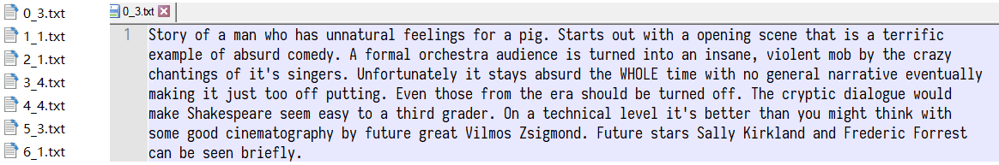
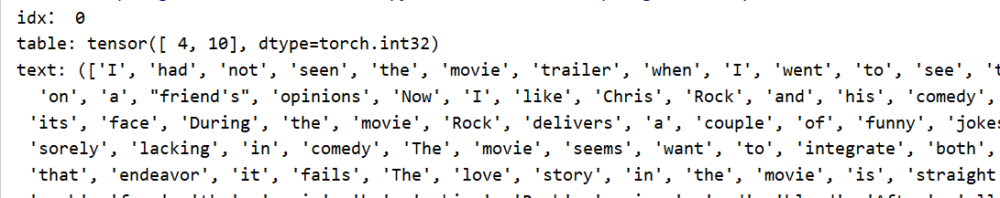

# 文本情感分类

## 目标

1. 知道文本处理的基本方法
2. 能够使用数据实现情感分类的


## 1. 案例介绍

为了对前面的word embedding这种常用的文本向量化的方法进行巩固，这里我们会完成一个文本情感分类的案例

现在我们有一个经典的数据集`IMDB`数据集，地址：`http://ai.stanford.edu/~amaas/data/sentiment/`，这是一份包含了5万条流行电影的评论数据，其中训练集25000条，测试集25000条。数据格式如下：

下图左边为名称，其中名称包含两部分，分别是序号和情感评分，（1-4为neg，5-10为pos），右边为评论内容



根据上述的样本，需要使用pytorch完成模型，实现对评论情感进行预测


## 2. 思路分析

首先可以把上述问题定义为分类问题，情感评分分为1-10，10个类别（也可以理解为回归问题，这里当做分类问题考虑）。那么根据之前的经验，我们的大致流程如下：

1. 准备数据集
2. 构建模型
3. 模型训练
4. 模型评估

知道思路之后，那么我们一步步来完成上述步骤

## 3. 准备数据集

准备数据集和之前的方法一样，实例化dataset，准备dataloader，最终我们的数据可以处理成如下格式：



其中有两点需要注意：

1. 如何完成基础打Dataset的构建和Dataloader的准备
2. 每个batch中文本的长度不一致的问题如何解决
3. 每个batch中的文本如何转化为数字序列

### 3.1 基础Dataset的准备

```python
import torch
from torch.utils.data import DataLoader,Dataset
import os
import re

data_base_path = r"data\aclImdb"

#1. 定义tokenize的方法
def tokenize(text):
    # fileters = '!"#$%&()*+,-./:;<=>?@[\\]^_`{|}~\t\n'
    fileters = ['!','"','#','$','%','&','\(','\)','\*','\+',',','-','\.','/',':',';','<','=','>','\?','@'
        ,'\[','\\','\]','^','_','`','\{','\|','\}','~','\t','\n','\x97','\x96','”','“',]
    text = re.sub("<.*?>"," ",text,flags=re.S)
    text = re.sub("|".join(fileters)," ",text,flags=re.S)
    return [i.strip() for i in text.split()]

#2. 准备dataset
class ImdbDataset(Dataset):
    def __init__(self,mode):
        super(ImdbDataset,self).__init__()
        if mode=="train":
            text_path = [os.path.join(data_base_path,i)  for i in ["train/neg","train/pos"]]
        else:
            text_path =  [os.path.join(data_base_path,i)  for i in ["test/neg","test/pos"]]

        self.total_file_path_list = []
        for i in text_path:
            self.total_file_path_list.extend([os.path.join(i,j) for j in os.listdir(i)])


    def __getitem__(self, idx):
        cur_path = self.total_file_path_list[idx]

        cur_filename = os.path.basename(cur_path)
        label = int(cur_filename.split("_")[-1].split(".")[0]) -1 #处理标题，获取label，转化为从[0-9]
        text = tokenize(open(cur_path).read().strip()) #直接按照空格进行分词
        return label,text

    def __len__(self):
        return len(self.total_file_path_list)
    
 # 2. 实例化，准备dataloader
dataset = ImdbDataset(mode="train")
dataloader = DataLoader(dataset=dataset,batch_size=2,shuffle=True)

#3. 观察数据输出结果
for idx,(label,text) in enumerate(dataloader):
    print("idx：",idx)
    print("table:",label)
    print("text:",text)
    break
```

输出如下：

```python
idx： 0
table: tensor([3, 1])
text: [('I', 'Want'), ('thought', 'a'), ('this', 'great'), ('was', 'recipe'), ('a', 'for'), ('great', 'failure'), ('idea', 'Take'), ('but', 'a'), ('boy', 's'), ('was', 'y'), ('it', 'plot'), ('poorly', 'add'), ('executed', 'in'), ('We', 'some'), ('do', 'weak'), ('get', 'completely'), ('a', 'undeveloped'), ('broad', 'characters'), ('sense', 'and'), ('of', 'than'), ('how', 'throw'), ('complex', 'in'), ('and', 'the'), ('challenging', 'worst'), ('the', 'special'), ('backstage', 'effects'), ('operations', 'a'), ('of', 'horror'), ('a', 'movie'), ('show', 'has'), ('are', 'known'), ('but', 'Let'), ('virtually', 'stew'), ('no', 'for'), ...('show', 'somehow'), ('rather', 'destroy'), ('than', 'every'), ('anything', 'copy'), ('worth', 'of'), ('watching', 'this'), ('for', 'film'), ('its', 'so'), ('own', 'it'), ('merit', 'will')]
```

明显，其中的text内容出现对应，和想象的不太相似，出现问题的原因在于`Dataloader`中的参数`collate_fn`

`collate_fn`的默认值为torch自定义的`default_collate`,`collate_fn`的作用就是对每个batch进行处理，而默认的`default_collate`处理出错。

解决问题的思路：

手段1：考虑先把数据转化为数字序列，观察其结果是否符合要求，之前使用DataLoader并未出现类似错误

手段2：考虑自定义一个`collate_fn`，观察结果

这里使用方式2，自定义一个`collate_fn`,然后观察结果：

```python
def collate_fn(batch):
	#batch是list，其中是一个一个元组，每个元组是dataset中__getitem__的结果
    batch = list(zip(*batch))
    labes = torch.tensor(batch[0],dtype=torch.int32)
    texts = batch[1]
    del batch
    return labes,texts
dataloader = DataLoader(dataset=dataset,batch_size=2,shuffle=True,collate_fn=collate_fn)

#此时输出正常
for idx,(label,text) in enumerate(dataloader):
    print("idx：",idx)
    print("table:",label)
    print("text:",text)
    break
```


### 3.2 文本序列化

> 再介绍word embedding的时候，我们说过，不会直接把文本转化为向量，而是先转化为数字，再把数字转化为向量，那么这个过程该如何实现呢？

这里我们可以考虑把文本中的每个**词语和其对应的数字，使用字典保存**，同时实现方法**把句子通过字典映射为包含数字的列表**。

实现文本序列化之前，考虑以下几点:

1. 如何使用字典把词语和数字进行对应
2. 不同的词语出现的次数不尽相同，是否需要对高频或者低频词语进行过滤，以及总的词语数量是否需要进行限制
3. 得到词典之后，如何把句子转化为数字序列，如何把数字序列转化为句子
4. 不同句子长度不相同，每个batch的句子如何构造成相同的长度（可以对短句子进行填充，填充特殊字符）
5. 对于新出现的词语在词典中没有出现怎么办（可以使用特殊字符代理）

思路分析：

1. 对所有句子进行分词
2. 词语存入字典，根据次数对词语进行过滤，并统计次数
3. 实现文本转数字序列的方法
4. 实现数字序列转文本方法

```python
import numpy as np

class Word2Sequence():
    UNK_TAG = "UNK"
    PAD_TAG = "PAD"

    UNK = 0
    PAD = 1

    def __init__(self):
        self.dict = {
            self.UNK_TAG :self.UNK,
            self.PAD_TAG :self.PAD
        }
        self.fited = False

    def to_index(self,word):
        """word -> index"""
        assert self.fited == True,"必须先进行fit操作"
        return self.dict.get(word,self.UNK)

    def to_word(self,index):
        """index -> word"""
        assert self.fited , "必须先进行fit操作"
        if index in self.inversed_dict:
            return self.inversed_dict[index]
        return self.UNK_TAG

    def __len__(self):
        return self(self.dict)

    def fit(self, sentences, min_count=1, max_count=None, max_feature=None):
        """
        :param sentences:[[word1,word2,word3],[word1,word3,wordn..],...]
        :param min_count: 最小出现的次数
        :param max_count: 最大出现的次数
        :param max_feature: 总词语的最大数量
        :return:
        """
        count = {}
        for sentence in sentences:
            for a in sentence:
                if a not in count:
                    count[a] = 0
                count[a] += 1

        # 比最小的数量大和比最大的数量小的需要
        if min_count is not None:
            count = {k: v for k, v in count.items() if v >= min_count}
        if max_count is not None:
            count = {k: v for k, v in count.items() if v <= max_count}

        # 限制最大的数量
        if isinstance(max_feature, int):
            count = sorted(list(count.items()), key=lambda x: x[1])
            if max_feature is not None and len(count) > max_feature:
                count = count[-int(max_feature):]
            for w, _ in count:
                self.dict[w] = len(self.dict)
        else:
            for w in sorted(count.keys()):
                self.dict[w] = len(self.dict)

        self.fited = True
        # 准备一个index->word的字典
        self.inversed_dict = dict(zip(self.dict.values(), self.dict.keys()))

    def transform(self, sentence,max_len=None):
        """
        实现吧句子转化为数组（向量）
        :param sentence:
        :param max_len:
        :return:
        """
        assert self.fited, "必须先进行fit操作"
        if max_len is not None:
            r = [self.PAD]*max_len
        else:
            r = [self.PAD]*len(sentence)
        if max_len is not None and len(sentence)>max_len:
            sentence=sentence[:max_len]
        for index,word in enumerate(sentence):
            r[index] = self.to_index(word)
        return np.array(r,dtype=np.int64)

    def inverse_transform(self,indices):
        """
        实现从数组 转化为文字
        :param indices: [1,2,3....]
        :return:[word1,word2.....]
        """
        sentence = []
        for i in indices:
            word = self.to_word(i)
            sentence.append(word)
        return sentence

if __name__ == '__main__':
    w2s = Word2Sequence()
    w2s.fit([
        ["你", "好", "么"],
        ["你", "好", "哦"]])

    print(w2s.dict)
    print(w2s.fited)
    print(w2s.transform(["你","好","嘛"]))
    print(w2s.transform(["你好嘛"],max_len=10))
```

完成了`wordsequence`之后，接下来就是保存现有样本中的数据字典，方便后续的使用。

实现对IMDB数据的处理和保存

```python
#1. 对IMDB的数据记性fit操作
def fit_save_word_sequence():
    from wordSequence import Word2Sequence

    ws = Word2Sequence()
    train_path = [os.path.join(data_base_path,i)  for i in ["train/neg","train/pos"]]
    total_file_path_list = []
    for i in train_path:
        total_file_path_list.extend([os.path.join(i, j) for j in os.listdir(i)])
    for cur_path in tqdm(total_file_path_list,ascii=True,desc="fitting"):
        ws.fit(tokenize(open(cur_path).read().strip()))
    ws.build_vocab()
    # 对wordSequesnce进行保存
    pickle.dump(ws,open("./model/ws.pkl","wb"))

#2. 在dataset中使用wordsequence
ws = pickle.load(open("./model/ws.pkl","rb"))

def collate_fn(batch):
    MAX_LEN = 500 
    #MAX_LEN = max([len(i) for i in texts]) #取当前batch的最大值作为batch的最大长度

    batch = list(zip(*batch))
    labes = torch.tensor(batch[0],dtype=torch.int)

    texts = batch[1]
    #获取每个文本的长度
    lengths = [len(i) if len(i)<MAX_LEN else MAX_LEN for i in texts]
    texts = torch.tensor([ws.transform(i, MAX_LEN) for i in texts])
    del batch
    return labes,texts,lengths

#3. 获取输出
dataset = ImdbDataset(ws,mode="train")
    dataloader = DataLoader(dataset=dataset,batch_size=20,shuffle=True,collate_fn=collate_fn)
    for idx,(label,text,length) in enumerate(dataloader):
        print("idx：",idx)
        print("table:",label)
        print("text:",text)
        print("length:",length)
        break
```

输出如下

```python
idx： 0
table: tensor([ 7,  4,  3,  8,  1, 10,  7, 10,  7,  2,  1,  8,  1,  2,  2,  4,  7, 10,
         1,  4], dtype=torch.int32)
text: tensor([[ 50983,  77480,  82366,  ...,      1,      1,      1],
        [ 54702,  57262, 102035,  ...,  80474,  56457,  63180],
        [ 26991,  57693,  88450,  ...,      1,      1,      1],
        ...,
        [ 51138,  73263,  80428,  ...,      1,      1,      1],
        [  7022,  78114,  83498,  ...,      1,      1,      1],
        [  5353, 101803,  99148,  ...,      1,      1,      1]])
length: [296, 500, 221, 132, 74, 407, 500, 130, 54, 217, 80, 322, 72, 156, 94, 270, 317, 117, 200, 379]

```

> 思考：前面我们自定义了MAX_LEN作为句子的最大长度，如果我们需要把每个batch中的最长的句子长度作为当前batch的最大长度，该如何实现？


## 4. 构建模型

这里我们只练习使用word embedding，所以模型只有一层，即：

1. 数据经过word embedding
2. 数据通过全连接层返回结果，计算`log_softmax`

```python
import torch
import torch.nn as nn
import torch.nn.functional as F
from torch import optim
from build_dataset import get_dataloader,ws,MAX_LEN

class IMDBModel(nn.Module):
    def __init__(self,max_len):
        super(IMDBModel,self).__init__()
        self.embedding = nn.Embedding(len(ws),300,padding_idx=ws.PAD) #[N,300]
        self.fc = nn.Linear(max_len*300,10)  #[max_len*300,10]

    def forward(self, x):
        embed = self.embedding(x) #[batch_size,max_len,300]
        embed = embed.view(x.size(0),-1)
        out = self.fc(embed)
        return F.log_softmax(out,dim=-1)
```


## 5. 模型的训练和评估

训练流程和之前相同

1. 实例化模型，损失函数，优化器
2. 遍历dataset_loader，梯度置为0，进行向前计算
3. 计算损失，反向传播优化损失，更新参数

```python
train_batch_size = 128
test_batch_size = 1000
imdb_model = IMDBModel(MAX_LEN)
optimizer = optim.Adam(imdb_model.parameters())
criterion = nn.CrossEntropyLoss()

def train(epoch):
    mode = True
    imdb_model.train(mode)
    train_dataloader =get_dataloader(mode,train_batch_size)
    for idx,(target,input,input_lenght) in enumerate(train_dataloader):
        optimizer.zero_grad()
        output = imdb_model(input)
        loss = F.nll_loss(output,target) #traget需要是[0,9]，不能是[1-10]
        loss.backward()
        optimizer.step()
        if idx %10 == 0:
            print('Train Epoch: {} [{}/{} ({:.0f}%)]\tLoss: {:.6f}'.format(
                epoch, idx * len(input), len(train_dataloader.dataset),
                       100. * idx / len(train_dataloader), loss.item()))

            torch.save(imdb_model.state_dict(), "model/mnist_net.pkl")
            torch.save(optimizer.state_dict(), 'model/mnist_optimizer.pkl')
            
 def test():
    test_loss = 0
    correct = 0
    mode = False
    imdb_model.eval()
    test_dataloader = get_dataloader(mode, test_batch_size)
    with torch.no_grad():
        for target, input, input_lenght in test_dataloader:
            output = imdb_model(input)
            test_loss  += F.nll_loss(output, target,reduction="sum")
            pred = torch.max(output,dim=-1,keepdim=False)[-1]
            correct = pred.eq(target.data).sum()
        test_loss = test_loss/len(test_dataloader.dataset)
        print('\nTest set: Avg. loss: {:.4f}, Accuracy: {}/{} ({:.2f}%)\n'.format(
            test_loss, correct, len(test_dataloader.dataset),
            100. * correct / len(test_dataloader.dataset)))

if __name__ == '__main__':
    test()
    for i in range(3):
        train(i)
        test()

```

这里我们仅仅使用了一层全连接层，其分类效果不会很好，这里重点是理解常见的模型流程和word embedding的使用方法