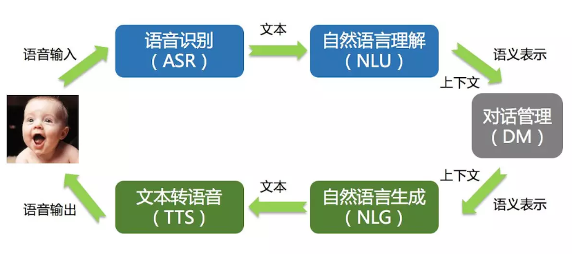
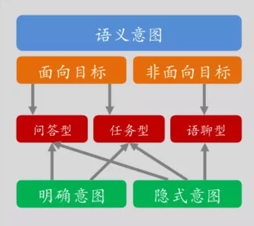
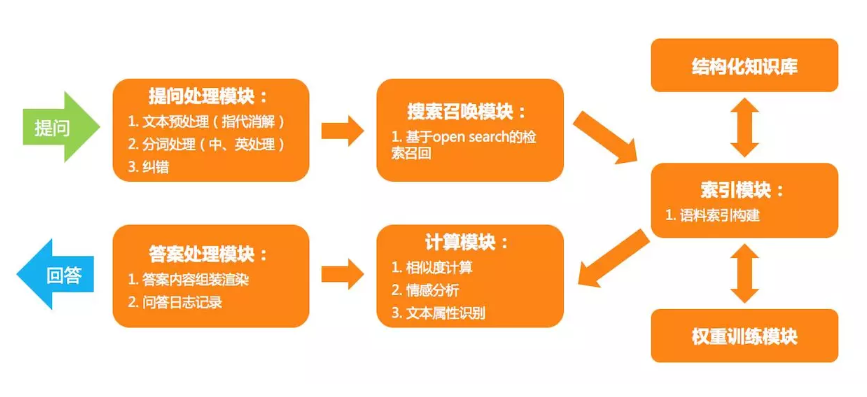

# 走进聊天机器人

## 学习目标

1. 知道常见的bot的分类
2. 知道企业中常见的流程和方法

## 1. 目前企业中的常见的聊天机器人

1. QA BOT（问答机器人）：回答问题
   1. 代表 ：智能客服、
   2. 比如：提问和回答
2. TASK BOT (任务机器人)：帮助人们做事情
   1. 代表：siri
   2. 比如：设置明天早上9点的闹钟
3. CHAT BOT(聊天机器人)：通用、开放聊天
   1. 代表：微软小冰

### 2. 常见的聊天机器人怎么实现的

##### 2.1 问答机器人的常见实现手段

1. 信息检索、搜索 （简单，效果一般，对数据问答对的要求高）

   关键词：tfidf、SVM、朴素贝叶斯、RNN、CNN

2. 知识图谱（相对复杂，效果好，很多论文）

   在图形数据库中存储知识和知识间的关系、把问答转化为查询语句、能够实现推理

##### 2.2 任务机器人的常见实现思路

1. 语音转文字
2. 意图识别、领域识别、文本分类
3. 槽位填充：比如买机票的机器人 使用命令体识别填充 `从{位置}到{位置}的票`2个位置的
4. 回话管理、回话策略
5. 自然语言生成
6. 文本转语音

##### 2.3 闲聊机器人的常见实现思路

1. 信息检索（简单、能够回答的话术有限）
2. seq2seq 和变种（答案覆盖率高，但是不能保证答案的通顺等）

## 3. 企业中的聊天机器人是如何实现的

### 3.1 阿里小蜜-电商智能助理是如何实现的

参考地址：`https://juejin.im/entry/59e96f946fb9a04510499c7f`

##### 3.1.1 主要交互过程

从图可以看出：

1. 输入：语音转化为文本，进行理解之后根据上下文得到语义的表示
2. 输出：根据语义的表是和生成方法得到文本，再把文本转化为语音输出

##### 3.1.2 技术架构

可以看出其流程为：

1. 判断用户意图
2. 如果意图为面向目标：可能是问答型或者是任务型
3. 如果非面向目标：可能是语聊型

##### 3.1.3 检索模型流程（小蜜还用了其他的模型，这里以此为例）

通过上图可知，小蜜的检索式回答的流程大致为：

1. 对问题进行处理
2. 根据问题进行召回，使用了提前准备的结构化的语料和训练的模型
3. 对召回的结果进行组长和日志记录
4. 对召回的结果进行相似度计算，情感分析和属性识别
5. 返回组装的结果

### 3.2 58同城智能客服帮帮如何实现的

参考地址：`http://www.6aiq.com/article/1536149308075?p=1&m=0`

#### 3.2.1 58客服体系

58的客服主要用户为公司端和个人端，智能客服主要实现自动回答，如果回答不好会转到人工客服，其中自动回答需要覆盖的问题包括：业务咨询、投诉建议等

#### 3.2.2 58智能客服整体架构

整体来看，58的客服架构分为三个部分

1. 基础服务，实现基础的NLP的功能和意图识别
2. 应用对话部分实现不同意图的模型，同时包括编辑运营等内容
3. 提供对外的接口

#### 3.2.3 业务咨询服务流程

##### 大致流程

KB-bot的流程大致为：

1. 对问题进行基础处理
2. 对答案通过tfidf等方法进行召回
3. 对答案通过规则、深度神经网络等方法进行重排序
4. 返回答案排序列表

##### 使用融合的模型

在问答模型的深度网络模型中使用了多套模型进行融合来获取结果

1. 在模型层应用了 FastText、TextCNN 和 Bi-LSTM 等模型
2. 在特征层尝试使用了单字、词、词性、词语属性等多种特征

通过以上两个模型来组合获取相似的问题，返回相似问题ID对应的答案

#### 3.2.4 58的闲聊机器人

58同城的闲聊机器人使用三种方法包括：

1. 基于模板匹配的方法
2. 基于搜索的方式获取（上上图）
3. 使用seq2seq的神经网络来实现

#### 3.2.5 解决不了转人工服务

​	智能客服解决不了的可以使用人工客服来实现

