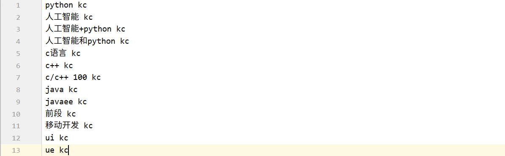

# 文本分词

## 目标

1. 完成停用词的准备
2. 完成分词方法的封装


## 1. 准备词典和停用词

### 1.1 准备词典



### 1.2 准备停用词

```python
stopwords = set([i.strip() for i in open(config.stopwords_path).readlines()])
```


## 2. 准备按照单个字切分句子的方法

```python
def _cut_by_word(sentence):
    # 对中文按照字进行处理，对英文不分为字母
    sentence = re.sub("\s+"," ",sentence)
    sentence = sentence.strip()
    result = []
    temp = ""
    for word in sentence:
        if word.lower() in letters:
            temp += word.lower()
        else:
            if temp != "": #不是字母
                result.append(temp)
                temp = ""
            if word.strip() in filters: #标点符号
                continue
            else: #是单个字
                result.append(word)
    if temp != "": #最后的temp中包含字母
        result.append(temp)
    return result
```


## 3. 完成分词方法的封装

lib 下创建`cut_sentence.py`文件，完成分词方法的构建

```python
import logging
import jieba
import jieba.posseg as psg
import config
import re
import string

#关闭jieba log输出
jieba.setLogLevel(logging.INFO)
#加载词典
jieba.load_userdict(config.keywords_path)
#单字分割，英文部分
letters = string.ascii_lowercase
#单字分割 去除的标点
filters= [",","-","."," "]
#停用词
stopwords = set([i.strip() for i in open(config.stopwords_path).readlines()])


def cut(sentence,by_word=False,use_stopwords=False,with_sg=False):
    assert by_word!=True or with_sg!=True,"根据word切分时候无法返回词性"
    if by_word:
        return _cut_by_word(sentence)
    else:
        ret = psg.lcut(sentence)
        if use_stopwords:
            ret = [(i.word,i.flag) for i in ret if i.word not in stopwords]
        if not with_sg:
            ret = [i.word for i in ret]
        return ret


def _cut_by_word(sentence):
    # 对中文按照字进行处理，对英文不分为字母
    sentence = re.sub("\s+"," ",sentence)
    sentence = sentence.strip()
    result = []
    temp = ""
    for word in sentence:
        if word.lower() in letters:
            temp += word.lower()
        else:
            if temp != "": #不是字母
                result.append(temp)
                temp = ""
            if word.strip() in filters: #标点符号
                continue
            else: #是单个字
                result.append(word)
    if temp != "": #最后的temp中包含字母
        result.append(temp)
    return result
```

