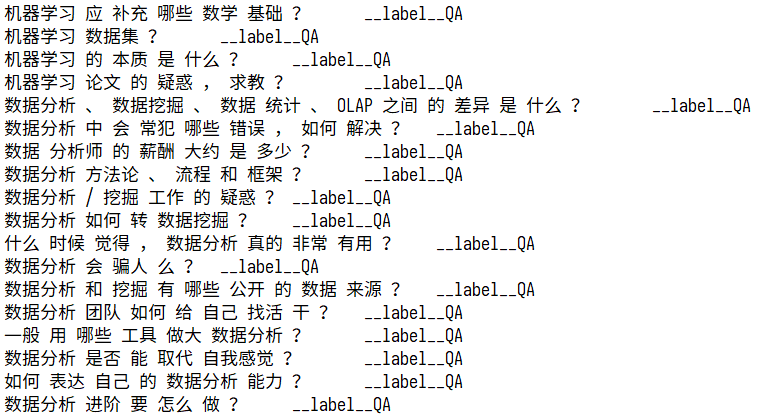
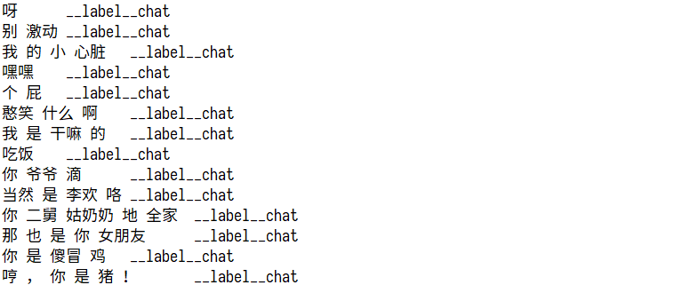

# fastText实现文本分类

## 目标

1. 知道fastext是什么
2. 能够应用fasttext进行文本分类
3. 能够完成项目中意图识别的代码


## 1.  fastText的介绍

文档地址：`https://fasttext.cc/docs/en/support.html`

fastText is a library for efficient learning of word representations and sentence classification.

fastText是一个单词表示学习和文本分类的库

优点：在标准的多核CPU上， 在10分钟之内能够训练10亿词级别语料库的词向量，能够在1分钟之内给30万多类别的50多万句子进行分类。

fastText 模型输入一个词的序列（一段文本或者一句话)，输出这个词序列属于不同类别的概率。


## 2. 安装和基本使用

### 2.1 安装步骤：

1. 下载 `git clone https://github.com/facebookresearch/fastText.git`
2. cd `cd fastText`
3. 安装 `python setup.py install`

#### 2.2 基本使用

1. 把数据准备为需要的格式

2. 进行模型的训练、保存和加载、预测

   ```python
   #1. 训练
   model = fastText.train_supervised("./data/text_classify.txt",wordNgrams=1,epoch=20)
   #2. 保存
   model.save_model("./data/ft_classify.model")
   #3. 加载
   model = fastText.load_model("./data/ft_classify.model")
   
   textlist = [句子1，句子2]
   #4. 预测，传入句子列表
   ret = model.predict(textlist)
   ```


## 3.  意图识别实现

### 3.1 数据准备

数据准备最终需要的形式如下：






以上格式是fastText要求的格式，其中chat、QA字段可以自定义，就是目标值，`__label__`之前的为特征值，需要使用`\t`进行分隔，特征值需要进行分词，`__label__`后面的是目标值


#### 3.1.1 准备特征文本

使用之前通过模板构造的样本和通过爬虫抓取的百度上的相似问题，

#### 3.1.2 准备闲聊文本

使用小黄鸡的语料，地址：https://github.com/fateleak/dgk_lost_conv/tree/master/results

#### 3.1.3 把文本转化为需要的格式

对两部分文本进行分词、合并，转化为需要的格式

```python
def prepar_data():
    #小黄鸡 作为闲聊
    xiaohaungji = "./corpus/recall/小黄鸡未分词.conv"
    handle_chat_corpus(xiaohaungji)
    # mongodb中的数据，问题和相似问题作为 问答
    handle_mongodb_corpus()

def keywords_in_line(line):
    """相似问题中去除关键字不在其中的句子
    """
    keywords_list = ["传智播客","传智","黑马程序员","黑马","python"
    "人工智能","c语言","c++","java","javaee","前端","移动开发","ui",
    "ue","大数据","软件测试","php","h5","产品经理","linux","运维","go语言",
    "区块链","影视制作","pmp","项目管理","新媒体","小程序","前端"]
    for keyword in keywords_list:
        if keyword in line:
            return True
    return False


def handle_chat_corpus(path):
    chat_num = 0
    with open("./corpus/recall/text_classify.txt","a") as f:
        for line in open(path,"r"):
            if line.strip() == "E" or len(line.strip())<1:
                continue
            elif keywords_in_line(line):
                continue
            elif line.startswith("M"):
                line = line[2:]
                line = re.sub("\s+"," ",line)
                line_cuted = " ".join(jieba_cut(line.strip())).strip()
                lable = "\t__label__{}\n".format("chat")
                f.write(line_cuted+lable)
                chat_num +=1
    print(chat_num)
    
def handle_QA_corpus():
  
    by_hand_data_path = "./corpus/recall/手动构造的问题.json" #手动构造的数据
    by_hand_data = json.load(open(by_hand_data_path))

    qa_num = 0

    f = open("./corpus/recall/text_classify.txt","a")
    for i in by_hand_data:
        for j in by_hand_data[i]:
            for x in j:
                x = re.sub("\s+", " ", x)
                line_cuted = " ".join(jieba_cut(x.strip())).strip()
                lable = "\t__label__{}\n".format("QA")
                f.write(line_cuted + lable)
                qa_num+=1

    #mogodb导出的数据
    for line in open("./corpus/recall/爬虫抓取的问题.csv"):
        line = re.sub("\s+", " ", line)
        line_cuted = " ".join(jieba_cut(line.strip()))
        lable = "\t__label__{}\n".format("QA")
        f.write(line_cuted + lable)
        qa_num += 1

    f.close()
    print(qa_num)
```

#### 3.1.4 思考：

是否可以把文本分割为单个字作为特征呢？

修改上述代码，准备一份以单个字作为特征的符合要求的文本

### 3.2 模型的训练

```python
import logging
import fastText
import pickle

logging.basicConfig(format='%(asctime)s : %(levelname)s : %(message)s', level=logging.DEBUG)


ft_model = fastText.train_supervised("./data/text_classify.txt",wordNgrams=1,epoch=20)
ft_model.save_model("./data/ft_classify.model")
```

训练完成后看看测试的结果

```python
ft_model = fastText.load_model("./data/ft_classify.model")

textlist = [
    # "人工智能 和 人工智障 有 啥 区别", #QA
    # "我 来 学 python 是不是 脑袋 有 问题 哦", #QA
    # "什么 是 python", #QA
    # "人工智能 和 python 有 什么 区别",  #QA
    # "为什么 要 学 python", #QA
    # "python 该 怎么 学",  #CHAT
    # "python", #QA
    "jave", #CHAT
    "php", #QA
    "理想 很 骨感 ，现实 很 丰满",
    "今天 天气 真好 啊",
    "你 怎么 可以 这样 呢",
    "哎呀 ， 我 错 了",
]
ret = ft_model.predict(textlist)
print(ret)
```

#### 3.2.2 模型的准确率该如何观察呢？

观察准备去，首先需要对文本进行划分，分为训练集和测试集，之后再使用测试集观察模型的准确率


### 3.3 模型的封装

为了在项目中更好的使用模型，需要对模型进行简单的封装，输入文本，返回结果

这里我们可以使用把单个字作为特征和把词语作为特征的手段结合起来实现

```python
"""
构造模型进行预测
"""
import fastText
import config
from lib import cut


class Classify:
    def __init__(self):
        self.ft_word_model = fastText.load_model(config.fasttext_word_model_path)
        self.ft_model = fastText.load_model(config.fasttext_model_path)

    def is_qa(self,sentence_info):
        python_qs_list = [" ".join(sentence_info["cuted_sentence"])]
        result = self.ft_mode.predict(python_qs_list)

        python_qs_list = [" ".join(cut(sentence_info["sentence"],by_word=True))]
        words_result = self.ft_word_mode.predict(python_qs_list)

        acc,word_acc = self.get_qa_prob(result,words_result)
        if acc>0.95 or word_acc>0.95:
            #是QA
            return True
        else:
            return False

    def get_qa_prob(self,result,words_result):
        label, acc, word_label, word_acc = zip(*result, *words_result)
        label = label[0]
        acc = acc[0]
        word_label = word_label[0]
        word_acc = word_acc[0]
        if label == "__label__chat":
            acc = 1 - acc
        if word_label == "__label__chat":
            word_acc = 1 - word_acc
        return acc,word_acc
```

