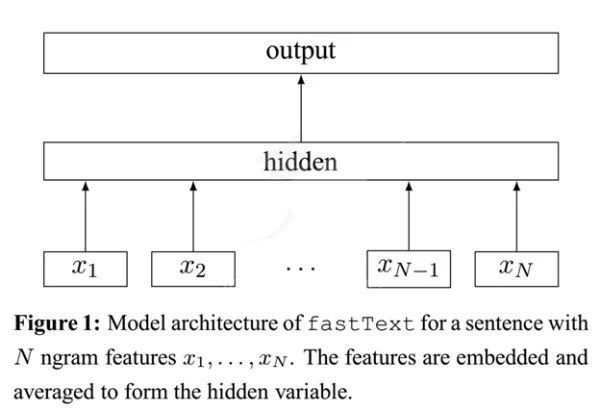
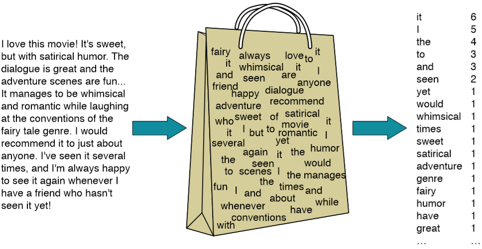
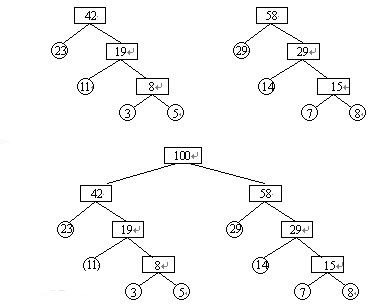
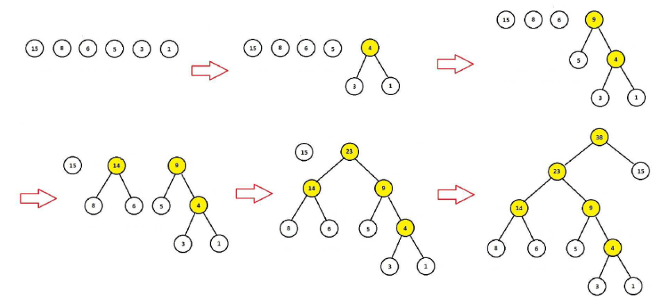
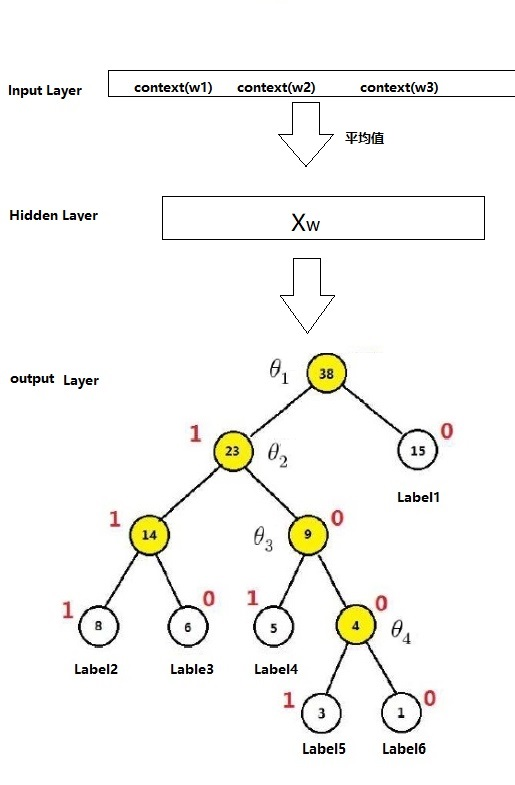
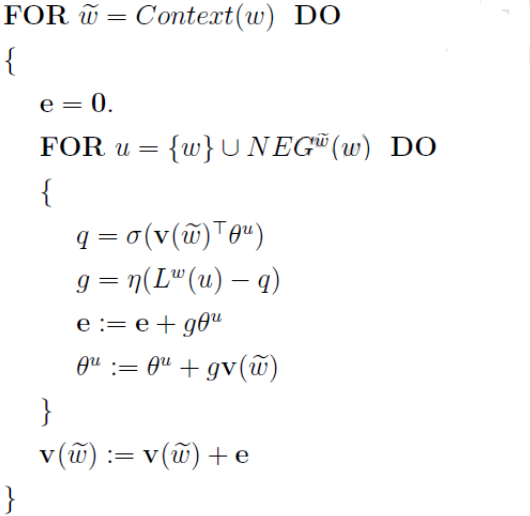

# fastText的原理剖析

## 目标

1. 能够说出fasttext的架构
2. 能够说出fasttext速度快的原因
3. 能够说出fastText中层次化的softmax是如何实现的

## 1. fastText的模型架构

fastText的架构非常简单，有三层：输入层、隐含层、输出层（Hierarchical Softmax）

输入层：是对文档embedding之后的向量，包含有N-garm特征

隐藏层：是对输入数据的求和平均

输出层：是文档对应标签

如下图所示：

### 1.1 N-garm的理解

### 1.1.1 bag of word

bag of word 又称为bow，称为词袋。是一种只统计词频的手段。

例如：在机器学习的课程中通过朴素贝叶斯来预测文本的类别，我们学习的countVectorizer和TfidfVectorizer都可以理解为一种bow模型。

### 1.1.2 N-gram模型

但是在很多情况下，词袋模型是不满足我们的需求的。

例如：`我爱她`  和`她爱我`在词袋模型下面，概率完全相同，但是其含义确实差别非常大。

为了解决这个问题，就有了N-gram模型，它不仅考虑词频，还会考虑当前词前面的词语，比如`我爱`，`她爱`。

N-gram模型的描述是：第n个词出现与前n-1个词相关，而与其他任何词不相关。（当然在很多场景下和前n-1个词也会相关，但是为了简化问题，经常会这样去计算）

例如：`I love deep learning`这个句子，在n=2的情况下，可以表示为`{i love},{love deep},{deep learning}，`n=3的情况下，可以表示为`{I love deep},{love deep learning}`。

在n=2的情况下，这个模型被称为Bi-garm（二元n-garm模型）

在n=3 的情况下，这个模型被称为Tri-garm（三元n-garm模型）

具体可以参考 [ed3book chapter3 ](http://web.stanford.edu/~jurafsky/slp3/ed3book.pdf)

所以在fasttext的输入层，不仅有分词之后的词语，还有包含有N-gram的组合词语一起作为输入

## 2. fastText中的层次化的softmax-对传统softmax的优化方法1

为了提高效率，在fastText中计算分类标签的概率的时候，不再是使用传统的softmax来进行多分类的计算，而是使用的哈夫曼树(Huffman，也成为霍夫曼树),使用层次化的softmax（Hierarchial softmax）来进行概率的计算。

### 2.1 哈夫曼树和哈夫曼编码

#### 2.1.1 哈夫曼树的定义

哈夫曼树概念：给定n个权值作为n个叶子结点，构造一棵二叉树，若该树的带权路径长度达到最小，称这样的二叉树为最优二叉树，也称为哈夫曼树(Huffman Tree)。

哈夫曼树是带权路径长度最短的树，权值较大的结点离根较近。

#### 2.1.2 哈夫曼树的相关概念

**二叉树**：每个节点最多有2个子树的有序树，两个子树分别称为左子树、右子树。有序的意思是：树有左右之分，不能颠倒

**叶子节点**：一棵树当中没有子结点的结点称为叶子结点，简称“叶子”

**路径和路径长度**：在一棵树中，从一个结点往下可以达到的孩子或孙子结点之间的通路，称为路径。通路中分支的数目称为路径长度。若规定根结点的层数为1，则从根结点到第L层结点的路径长度为L-1。

**结点的权及带权路径长度**：若将树中结点赋给一个有着某种含义的数值，则这个数值称为该结点的权。结点的带权路径长度为：从根结点到该结点之间的路径长度与该结点的权的**乘积**。

**树的带权路径长度**：树的带权路径长度规定为所有叶子结点的带权路径长度之和

**树的高度**：树中结点的最大层次。包含n个结点的二叉树的高度至少为**log2 (n+1)**。

#### 2.1.3 哈夫曼树的构造算法

1. 把$\{W_1,W_2,W_3 \dots W_n\}​$看成n棵树的森林
2. 在森林中选择两个根节点权值最小的树进行合并，作为一颗新树的左右子树，新树的根节点权值为左右子树的和
3. 删除之前选择出的子树，把新树加入森林
4. 重复2-3步骤，直到森林只有一棵树为止，概树就是所求的哈夫曼树

例如：圆圈中的表示每个词语出现的次数，以这些词语为叶子节点构造的哈夫曼树过程如下：

可见：

1. 权重越大，距离根节点越近
2. 叶子的个数为n，构造哈夫曼树中新增的节点的个数为n-1

#### 2.2.1 哈夫曼编码

在数据通信中，需要将传送的文字转换成二进制的字符串，用0，1码的不同排列来表示字符。

例如，需传送的报文为`AFTER DATA EAR ARE ART AREA`，这里用到的字符集为`A，E，R，T，F，D`，各字母出现的次数为{8，4，5，3，1，1}。现要求为这些字母设计编码。要区别6个字母，最简单的二进制编码方式是等长编码，固定采用3位二进制，可分别用`000、001、010、011、100、101`对`A，E，R，T，F，D`进行编码发送

但是很明显，上述的编码的方式并不是最优的，即整理传送的字节数量并不是最少的。

为了提高数据传送的效率，同时为了保证`任一字符的编码都不是另一个字符编码的前缀，这种编码称为前缀编码[前缀编码]`,可以使用哈夫曼树生成哈夫曼编码解决问题

可用字符集中的每个字符作为叶子结点生成一棵编码二叉树，为了获得传送报文的最短长度，可将每个字符的出现频率作为字符结点的权值赋予该结点上，显然字使用频率越小权值越小，权值越小叶子就越靠下，于是频率小编码长，频率高编码短，这样就保证了此树的最小带权路径长度效果上就是传送报文的最短长度

因此，求传送报文的最短长度问题转化为求由字符集中的所有字符作为叶子结点，由字符出现频率作为其权值所产生的哈夫曼树的问题。利用哈夫曼树来设计二进制的前缀编码，既满足前缀编码的条件，又保证报文编码总长最短。

下图中`label1 .... label6`分别表示`A，E，R，T，F，D`

#### 2.3 梯度计算

上图中，红色为哈夫曼编码，即label5的哈夫曼编码为1001，那么此时如何定义条件概率$P(Label5|contex)​$呢？

以Label5为例，从根节点到Label5中间经历了4次分支，每次分支都可以认为是进行了一次2分类，根据哈夫曼编码，可以把路径中的每个非叶子节点0认为是负类，1认为是正类（也可以把0认为是正类）

由机器学习课程中逻辑回归使用sigmoid函数进行2分类的过程中，一个节点被分为正类的概率是$\delta(X^{T}\theta) = \frac{1}{1+e^{-X^T\theta}}$,被分类负类的概率是：$1-\delta(X^T\theta)$，其中$\theta$就是图中非叶子节点对应的参数$\theta$。

对于从根节点出发，到达Label5一共经历4次2分类，将每次分类结果的概率写出来就是：

1. 第一次：$P(1|X,\theta_1) = \delta(X^T\theta_1) $ ,即从根节点到23节点的概率是在知道X和$\theta_1$的情况下取值为1的概率
2. 第二次：$P(0|X,\theta_2) =1- \delta(X^T\theta_2) $  
3. 第三次：$P(0 |X,\theta_3) =1- \delta(X^T\theta_4) $
4. 第四次：$P(1|X,\theta_4) = \delta(X^T\theta_4) $

但是我们需要求的是$P(Label|contex)$, 他等于前4词的概率的乘积，公式如下（$d_j^w​$是第j个节点的哈夫曼编码）
$$
P(Label|context) = \prod_{j=2}^5P(d_j|X,\theta_{j-1})
$$

其中：
$$
P(d_j|X,\theta_{j-1}) = \left\{
\begin{aligned}
&\delta(X^T\theta_{j-1}), & d_j=1;\\
&1-\delta(X^T\theta_{j-1}) & d_j=0;
\end{aligned}
\right.
$$

或者也可以写成一个整体,把目标值作为指数，之后取log之后会前置：
$$
P(d_j|X,\theta_{j-1}) = [\delta(X^T\theta_{j-1})]^{d_j} \cdot [1-\delta(X^T\theta_{j-1})]^{1-d_j}
$$

在机器学习中的逻辑回归中，我们经常把二分类的损失函数(目标函数)定义为对数似然损失，即
$$
l =-\frac{1}{M} \sum_{label\in labels} log\ P(label|context)
$$

式子中，求和符号表示的是使用样本的过程中，每一个label对应的概率取对数后的和，之后求取均值。

带入前面对$P(label|context)​$的定义得到：
$$
\begin{align*}
l & = -\frac{1}{M}\sum_{label\in labels}log \prod_{j=2}\{[\delta(X^T\theta_{j-1})]^{d_j} \cdot [1-\delta(X^T\theta_{j-1})]^{1-d_j}\} \\
& =-\frac{1}{M} \sum_{label\in labels} \sum_{j=2}\{d_j\cdot log[\delta(X^T\theta_{j-1})]+ (1-d_j) \cdot log [1-\delta(X^T\theta_{j-1})]\}
\end{align*}
$$
有了损失函数之后，接下来就是对其中的$X,\theta$进行求导，并更新，最终还需要更新最开始的每个词语词向量

**层次化softmax的好处**：传统的softmax的时间复杂度为L（Labels的数量），但是使用层次化softmax之后时间复杂度的log(L) （二叉树高度和宽度的近似），从而在多分类的场景提高了效率

## 3. fastText中的negative sampling(负采样)-对传统softmax的优化方法2

negative sampling，即每次从除当前label外的其他label中，随机的选择几个作为负样本。具体的采样方法：

如果所有的label为$V​$,那么我们就将一段长度为1的线段分成$V​$份，每份对应所有label中的一类label。当然每个词对应的线段长度是不一样的，高频label对应的线段长，低频label对应的线段短。每个label的线段长度由下式决定：
$$
len(w) = \frac{count(label)^{\alpha}}{\sum_{w \in labels} count(labels)^{\alpha}},a在fasttext中为0.75，即负采样的数量和原来词频的平方根成正比
$$
在采样前，我们将这段长度为1的线段划分成$M​$等份，这里$M>>V​$，这样可以保证每个label对应的线段都会划分成对应的小块。而M份中的每一份都会落在某一个label对应的线段上。在采样的时候，我们只需要从$M​$个位置中采样出neg个位置就行，此时采样到的每一个位置对应到的线段所属的词就是我们的负例。

简单的理解就是，从原来所有的样本中，等比例的选择neg个负样本作（遇到自己则跳过），作为训练样本，添加到训练数据中，和正例样本一起来进行训练。

Negative Sampling也是采用了二元逻辑回归来求解模型参数，通过负采样，我们得到了neg个负例，将正例定义为$label_0​$,负例定义为$label_i,i=1,2,3...neg​$

定义正例的概率为$P\left( label_{0}|\text {context}\right)=\sigma\left(x_{\mathrm{k}}^{T} \theta\right), y_{i}=1​$

则负例的概率为：$P\left( label_{i}|\text {context}\right)=1-\sigma\left(x_{\mathrm{k}}^{T} \theta\right), y_{i}=0,i=1,2,3..neg​$

此时对应的对数似然函数为：
$$
L=\sum_{i=0}^{n e g} y_{i} \log \left(\sigma\left(x_{label_0}^{T} \theta\right)\right)+\left(1-y_{i}\right) \log \left(1-\sigma\left(x_{label_0}^{T} \theta\right)\right)
$$
具体的训练时候损失的计算过程(源代码已经更新)：

可以看出：一个neg+1个样本进行了训练，得到了总的损失。

之后会使用梯度上升的方法进行梯度计算和参数更新，仅仅每次只用一波样本(一个正例和neg个反例)更新梯度，来进行迭代更新

具体的更新伪代码如下:

其中内部大括号部分为w相关参数的梯度计算过程，e为w的梯度和学习率的乘积，具体参考:<https://blog.csdn.net/itplus/article/details/37998797>

好处：

1. 提高训练速度，选择了部分数据进行计算损失，同时整个对每一个label而言都是一个二分类，损失计算更加简单，只需要让当前label的值的概率尽可能大，其他label的都为反例，概率会尽可能小
2. 改进效果，增加部分负样本，能够模拟真实场景下的噪声情况，能够让模型的稳健性更强

