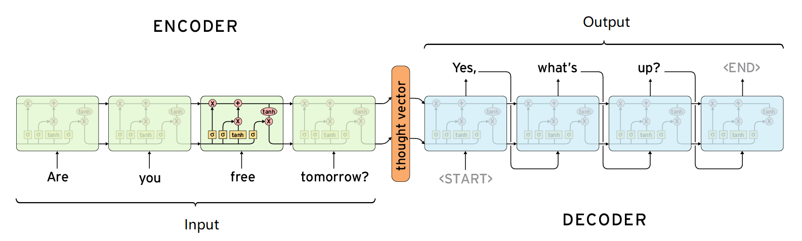

# Seq2Seq模型的原理

## 目标

1. 知道seq2seq的常见应用场景
2. 能够说出常见的seq2seq的结构
3. 能够使用代码完成基础的seq2seq的结构


## 1. Seq2Seq的介绍



`Sequence to sequence (seq2seq)`是由`encoder（编码器）`和`decoder（解码器）`两个RNN的组成的。其中encoder负责对输入句子的理解，转化为`context vector`，decoder负责对理解后的句子的向量进行处理，解码，获得输出。上述的过程和我们大脑理解东西的过程很相似，`听到一句话，理解之后，尝试组装答案，进行回答`

那么此时，就有一个问题，在encoder的过程中得到的context vector作为decoder的输入，那么这样一个输入，怎么能够得到多个输出呢？

其实就是`当前一步的输出，作为下一个单元的输入，然后得到结果`

```python
outputs = []
while True:
    output = decoderd(output)
    outputs.append(output)
```

那么循环什么时候停止呢？

在训练数据集中，可以再输出的最后面添加一个结束符`<END>`，如果遇到该结束符，则可以终止循环

```python
outputs = []
while output!="<END>":
    output = decoderd(output)
    outputs.append(output)
```

这个结束符只是一个标记，很多人也会使用`<EOS>(End Of Sentence)`

总之：Seq2seq模型中的encoder接受一个长度为M的序列，得到1个 context vector，之后decoder把这一个context vector转化为长度为N的序列作为输出，从而构成一个`M to N`的模型，能够处理很多不定长输入输出的问题，比如：`文本翻译，问答，文章摘要，关键字写诗等等`


## 2. Seq2Seq模型的实现

下面，我们通过一个简单的列子，来看看普通的Seq2Seq模型应该如何实现。

**需求**：完成一个模型，实现往模型输入一串数字，输出这串数字+0

**例如**：

- 输入`123456789`，输出`1234567890`；
- 输入`52555568`，输出`525555680`

### 2.1 实现流程

1. 文本转化为序列（数字序列，`torch.LongTensor`）
2. 使用序列，准备数据集，准备`Dataloader`
3. 完成编码器
4. 完成解码器
5. 完成seq2seq模型
6. 完成模型训练的逻辑，进行训练
7. 完成模型评估的逻辑，进行模型评估

### 2.2 文本转化为序列

由于输入的是数字，为了把这写数字和词典中的真实数字进行对应，可以把这些数字理解为字符串

那么我们需要做的就是：

1. 把字符串对应为数字
2. 把数字转化为字符串

完成逻辑和之前相同，创建`word_sequence.py`文件，实现上述逻辑

```python

class NumSequence:
    UNK_TAG = "UNK" #未知词
    PAD_TAG = "PAD" #填充词，实现文本对齐，即一个batch中的句子长度都是相同的，短句子会被padding
    EOS_TAG = "EOS" #句子的开始
    SOS_TAG = "SOS" #句子的结束

    UNK = 0
    PAD = 1
    EOS = 2
    SOS = 3

    def __init__(self):
        self.dict = {
            self.UNK_TAG : self.UNK,
            self.PAD_TAG : self.PAD,
            self.EOS_TAG : self.EOS,
            self.SOS_TAG : self.SOS
        }
        #得到字符串和数字对应的字典
        for i in range(10):
            self.dict[str(i)] = len(self.dict)
		#得到数字和字符串对应的字典
        self.index2word = dict(zip(self.dict.values(),self.dict.keys()))

    def __len__(self):
        return len(self.dict)

    def transform(self,sequence,max_len=None,add_eos=False):
        """
        sequence：句子
        max_len :句子的最大长度
        add_eos:是否添加结束符
        """
        
        sequence_list = list(str(sequence))
        seq_len = len(sequence_list)+1 if add_eos else len(sequence_list)

        if add_eos and max_len is not None:
            assert max_len>= seq_len, "max_len 需要大于seq+eos的长度"
        _sequence_index = [self.dict.get(i,self.UNK) for i in sequence_list]
        if add_eos:
            _sequence_index += [self.EOS]
        if max_len is not None:
            sequence_index = [self.PAD]*max_len
            sequence_index[:seq_len] =  _sequence_index
            return sequence_index
        else:
            return _sequence_index

    def inverse_transform(self,sequence_index):
        result = []
        for i in sequence_index:
            if i==self.EOS:
                break
            result.append(self.index2word.get(int(i),self.UNK_TAG))
        return result
# 实例化，供后续调用
num_sequence = NumSequence()

if __name__ == '__main__':
    num_sequence = NumSequence()
    print(num_sequence.dict)
    print(num_sequence.index2word)
    print(num_sequence.transform("1231230",add_eos=True))
```


### 2.3 准备数据集

#### 2.3.1 准备`Dataset`

这里，我们使用随机创建的`[0,100000000]`的整型，来准备数据集

```python
from torch.utils.data import Dataset,DataLoader
import numpy as np
from word_sequence import num_sequence
import torch
import config

class RandomDataset(Dataset):
    def __init__(self):
        super(RandomDataset,self).__init__()
        self.total_data_size = 500000
        np.random.seed(10)
        self.total_data = np.random.randint(1,100000000,size=[self.total_data_size])

    def __getitem__(self, idx):
        """返回input，target，input_length,target_length(真实长度)"""
        input = str(self.total_data[idx])
        return input, input+ "0",len(input),len(input)+1

    def __len__(self):
        return self.total_data_size
```

通过随机数的结果，可以看到，大部分的数字长度为8，在目标值后面添加上0和EOS之后，最大长度为10

所以常见config配置文件，添加上`max_len：文本最大长度`，方便后续的修改

#### 2.3.2 准备`DataLoader`

在准备`DataLoader`的过程中，可以通过定义的collate_fn来实现对dataset中batch数据的处理

其中需要注意：

1. 需要对batch中的数据进行排序，根据数据的真实长度进行降序排序（后面需要用到）
2. 需要调用`文本序列化`的方法，把文本进行序列化的操作，同时target需要进行`add eos`的操作
3. 最后返回序列的LongTensor格式
4. 在`DataLoader中有drop_last参数`，当数据量无法被batch_size整除时，最后一个batch的数据个数和之前的数据个数长度不同，可以考虑进行删除

```python
def collate_fn(batch):
    #1. 对batch进行排序，按照长度从长到短的顺序排序
    batch = sorted(batch,key=lambda x:x[3],reverse=True)
    input,target,input_length,target_length = zip(*batch)

    #2.进行padding的操作
    input = torch.LongTensor([num_sequence.transform(i,max_len=config.max_len) for i in input])
    target = torch.LongTensor([num_sequence.transform(i,max_len=config.max_len,add_eos=True) for i in target])
    input_length = torch.LongTensor(input_length)
    target_length = torch.LongTensor(target_length)

    return input,target,input_length,target_length

data_loader = DataLoader(dataset=RandomDataset(),batch_size=config.batch_size,collate_fn=collate_fn,drop_last=True)
```


### 2.4 准备编码器

编码器（encoder）的目的就是为了对文本进行编码，把编码后的结果交给后续的程序使用，所以在这里我们可以使用`Embedding+GRU`的结构来使用，使用最后一个`time step`的输出(`hidden state`)作为`句子的编码结果`


注意点：

1. Embedding和GRU的参数,这里我们让GRU中batch放在前面
2. 输出结果的形状
3. 在LSTM和GRU中，每个`time step`的输入会进行计算，得到结果，整个过程是一个和句子长度相关的一个循环，手动实现速度较慢
   1. pytorch中实现了`nn.utils.rnn.pack_padded_sequence` 对padding后的句子进行打包的操作能够更快获得LSTM or GRU的结果
   2. 同时实现了`nn.utils.rnn.pad_packed_sequence`对打包的内容进行解包的操作
4. `nn.utils.rnn.pack_padded_sequence`使用过程中需要对batch中的内容按照句子的长度**降序排序**

实现代码如下：

```python
import torch.nn as nn
from word_sequence import num_sequence
import config


class NumEncoder(nn.Module):
    def __init__(self):
        super(NumEncoder,self).__init__()
        self.vocab_size = len(num_sequence)
        self.dropout = config.dropout
        self.embedding = nn.Embedding(num_embeddings=self.vocab_size,embedding_dim=config.embedding_dim,padding_idx=num_sequence.PAD)
        self.gru = nn.GRU(input_size=config.embedding_dim,
                          hidden_size=config.hidden_size,
                          num_layers=1,
                          batch_first=True)

    def forward(self, input,input_length):
        """
        input:[batch_size,max_len]
        input_length:[batch_size]
        """
        embeded = self.embedding(input) #[batch_size,max_len , embedding_dim]
        
        #对文本对齐之后的句子进行打包，能够加速在LSTM or GRU中的计算过程
        embeded = nn.utils.rnn.pack_padded_sequence(embeded,lengths=input_length,batch_first=True)

        #hidden:[1,batch_size,vocab_size]
        out,hidden = self.gru(embeded)
        
        #对前面打包后的结果再进行解包
        out,outputs_length = nn.utils.rnn.pad_packed_sequence(out,batch_first=True,padding_value=num_sequence.PAD)
        # out [batch_size,seq_len,hidden_size]
        return out,hidden
```


### 2.5 实现解码器

加码器主要负责实现对编码之后结果的处理，得到预测值，为后续计算损失做准备

此时需要思考：

1. 使用什么样的损失函数，预测值需要是什么格式的

   - 结合之前的经验，我们可以理解为当前的问题是一个分类的问题，即每次的输出其实对选择一个概率最大的词
   - 真实值的形状是`[batch_size,max_len]`，从而我们知道输出的结果需要是一个`[batch_size,max_len,vocab_size]`的形状
   - 即预测值的最后一个维度进行计算log_softmax,然后和真实值进行相乘，从而得到损失

2. 如何把编码结果`[1,batch_size,hidden_size]`进行操作，得到预测值。解码器也是一个RNN，即也可以使用LSTM or GRU的结构，所以在解码器中：

   - 通过循环，每次计算的一个time step的内容

   - 编码器的结果作为初始的隐层状态，定义一个`[batch_size,1]`的全为`SOS`的数据作为最开始的输入，告诉解码器，要开始工作了
   - 通过解码器预测一个输出`[batch_size,hidden_size]`(会进行形状的调整为`[batch_size,vocab_size]`)，把这个输出作为输入再使用解码器进行解码
   - 上述是一个循环，循环次数就是句子的最大长度，那么就可以得到`max_len`个输出
   - 把所有输出的结果进行concate，得到`[batch_size,max_len,vocab_size]`

3. 在RNN的训练过程中，使用前一个预测的结果作为下一个step的输入，可能会导致`一步错，步步错的结果`，如果提高模型的收敛速度？

   - 可以考虑在训练的过程中，把真实值作为下一步的输入，这样可以避免`步步错的局面`
   - 同时在使用真实值的过程中，仍然使用预测值作为下一步的输入，两种输入随机使用
   - 上述这种机制我们把它称为`Teacher forcing`，就像是一个指导老师，在每一步都会对我们的行为进行纠偏，从而达到在多次训练之后能够需要其中的规律
   - 

   

```python
import torch
import torch.nn as nn
import config
import random
import torch.nn.functional as F
from word_sequence import num_sequence

class NumDecoder(nn.Module):
    def __init__(self):
        super(NumDecoder,self).__init__()
        self.max_seq_len = config.max_len
        self.vocab_size = len(num_sequence)
        self.embedding_dim = config.embedding_dim
        self.dropout = config.dropout

        self.embedding = nn.Embedding(num_embeddings=self.vocab_size,embedding_dim=self.embedding_dim,padding_idx=num_sequence.PAD)
        self.gru = nn.GRU(input_size=self.embedding_dim,
                          hidden_size=config.hidden_size,
                          num_layers=1,
                          batch_first=True,
                          dropout=self.dropout)
        self.log_softmax = nn.LogSoftmax()

        self.fc = nn.Linear(config.hidden_size,self.vocab_size)

    def forward(self, encoder_hidden,target,target_length):
        # encoder_hidden [batch_size,hidden_size]
        # target [batch_size,max_len]
		
        #初始的全为SOS的输入
        decoder_input = torch.LongTensor([[num_sequence.SOS]]*config.batch_size)

        #解码器的输出，用来后保存所有的输出结果
        decoder_outputs = torch.zeros(config.batch_size,config.max_len,self.vocab_size) 
		
        decoder_hidden = encoder_hidden #[batch_size,hidden_size]

        for t in range(config.max_len):
            decoder_output_t , decoder_hidden = self.forward_step(decoder_input,decoder_hidden)
            
            #在不同的time step上进行复制，decoder_output_t [batch_size,vocab_size]
            decoder_outputs[:,t,:] = decoder_output_t
			
            #在训练的过程中，使用 teacher forcing，进行纠偏
            use_teacher_forcing = random.random() > 0.5
            if use_teacher_forcing:
                #下一次的输入使用真实值
                decoder_input =target[:,t].unsqueeze(1)  #[batch_size,1]
            else:
                #使用预测值，topk中k=1，即获取最后一个维度的最大的一个值
                value, index = torch.topk(decoder_output_t, 1) # index [batch_size,1]
                decoder_input = index
        return decoder_outputs,decoder_hidden

    def forward_step(self,decoder_input,decoder_hidden):
        """
        :param decoder_input:[batch_size,1]
        :param decoder_hidden: [1,batch_size,hidden_size]
        :return: out:[batch_size,vocab_size],decoder_hidden:[1,batch_size,didden_size]
        """
        embeded = self.embedding(decoder_input)  #embeded: [batch_size,1 , embedding_dim]

        out,decoder_hidden = self.gru(embeded,decoder_hidden) #out [1, batch_size, hidden_size]

       	out = out.squeeze(0) #去除第0维度的1
        #进行全连接形状变化，同时进行求取log_softmax
        out = F.log_softmax(self.fc(out),dim=-1)#out [batch_Size,1, vocab_size]
        out = out.squeeze(1)
        return out,decoder_hidden

```


### 2.6 完成seq2seq模型

调用之前的encoder和decoder，完成模型的搭建

```python
import torch
import torch.nn as nn

class Seq2Seq(nn.Module):
    def __init__(self,encoder,decoder):
        super(Seq2Seq,self).__init__()
        self.encoder = encoder
        self.decoder = decoder

    def forward(self, input,target,input_length,target_length):
        #进行编码
        encoder_outputs,encoder_hidden = self.encoder(input,input_length)
        #进行解码
        decoder_outputs,decoder_hidden = self.decoder(encoder_hidden,target,target_length)
        return decoder_outputs,decoder_hidden
```


### 2.7 完成训练逻辑

思路流程和之前相同

```python
import torch
import config
from torch import optim
import torch.nn as nn
from encoder import NumEncoder
from decoder import NumDecoder
from seq2seq import Seq2Seq
from dataset import data_loader as train_dataloader
from word_sequence import num_sequence


encoder = NumEncoder()
decoder = NumDecoder()
model = Seq2Seq(encoder,decoder)
print(model)

#自定义初始化参数
#for name, param in model.named_parameters():
#    if 'bias' in name:
#        torch.nn.init.constant_(param, 0.0)
#    elif 'weight' in name:
#        torch.nn.init.xavier_normal_(param)

# model.load_state_dict(torch.load("model/seq2seq_model.pkl"))
optimizer =  optim.Adam(model.parameters())
# optimizer.load_state_dict(torch.load("model/seq2seq_optimizer.pkl"))
criterion= nn.NLLLoss(ignore_index=num_sequence.PAD,reduction="mean")

def get_loss(decoder_outputs,target):
    #很多时候如果tensor进行了转置等操作，直接调用view进行形状的修改是无法成功的
    #target = target.contiguous().view(-1) #[batch_size*max_len]
    target = target.view(-1)
    decoder_outputs = decoder_outputs.view(config.batch_size*config.max_len,-1)
    return criterion(decoder_outputs,target)


def train(epoch):
    for idx,(input,target,input_length,target_len) in enumerate(train_dataloader):
        optimizer.zero_grad()
        ##[seq_len,batch_size,vocab_size] [batch_size,seq_len]
        decoder_outputs,decoder_hidden = model(input,target,input_length,target_len)
        loss = get_loss(decoder_outputs,target)
        loss.backward()
        optimizer.step()

        print('Train Epoch: {} [{}/{} ({:.0f}%)]\tLoss: {:.6f}'.format(
            epoch, idx * len(input), len(train_dataloader.dataset),
                   100. * idx / len(train_dataloader), loss.item()))

        torch.save(model.state_dict(), "model/seq2seq_model.pkl")
        torch.save(optimizer.state_dict(), 'model/seq2seq_optimizer.pkl')

if __name__ == '__main__':
    for i in range(10):
        train(i)
```


### 2.8 完成模型评估逻辑

完成评估逻辑，和decoder中的训练过程稍微不同，可以在其中新建`evaluation`的方法，传入`encoder_hidden`，得到预测的结果

```python
    def evaluation(self,encoder_hidden): #[1, 20, 14]
        batch_size = encoder_hidden.size(1) #评估的时候和训练的batch_size不同，不适用config的配置

        decoder_input = torch.LongTensor([[num_sequence.SOS] * batch_size])
        decoder_outputs = torch.zeros(batch_size,config.max_len, self.vocab_size)  # [batch_size，seq_len,vocab_size]
        decoder_hidden = encoder_hidden
		
        #评估，不再使用teacher forcing，完全使用预测值作为下一次的输入
        for t in range(config.max_len):
            decoder_output_t, decoder_hidden = self.forward_step(decoder_input, decoder_hidden)
            decoder_outputs[:,t,:] = decoder_output_t
            value, index = torch.topk(decoder_output_t, 1)  # index [20,1]
            decoder_input = index.transpose(0, 1)

        #获取输出的id
        decoder_indices = []  #[[1,2,4],[23,3,2]]
        for i in range(config.max_len):
            value,index = torch.topk(decoder_outputs[:,i,:],k=1,dim=-1)
            decoder_indices.append(index.view(-1).numpy())
        #transpose 调整为按句子输出
        decoder_indices = np.array(decoder_indices).transpose() 
        return decoder_indices
```

之后再seq2seq的model中，添加`evaluation`的逻辑

```python
import torch
import torch.nn as nn

class Seq2Seq(nn.Module):
    def __init__(self,encoder,decoder):
        super(Seq2Seq,self).__init__()
        self.encoder = encoder
        self.decoder = decoder

    def forward(self, input,target,input_length,target_length):
        encoder_outputs,encoder_hidden = self.encoder(input,input_length)
        decoder_outputs,decoder_hidden = self.decoder(encoder_hidden,target,target_length)
        return decoder_outputs,decoder_hidden

    def evaluation(self,inputs,input_length):
        encoder_outputs,encoder_hidden = self.encoder(inputs,input_length)
        decoded_sentence = self.decoder.evaluation(encoder_hidden)
        return decoded_sentence
```

创建`eval.py`，完成模型评估的逻辑

```python
import torch
import config
from torch import optim
import torch.nn as nn
from encoder import NumEncoder
from decoder import NumDecoder
from seq2seq import Seq2Seq
from dataset import data_loader as train_dataloader
from word_sequence import num_sequence
import numpy as np
import random


encoder = NumEncoder()
decoder = NumDecoder()
model = Seq2Seq(encoder,decoder)
model.load_state_dict(torch.load("model/seq2seq_model.pkl"))

def evalaute():
    data = [str(i) for i in np.random.randint(0, 100000000, [10])]
    data = sorted(data,key=lambda x:len(x),reverse=True)
    print(data)

    _data_length = torch.LongTensor([len(i) for i in data])
    _data = torch.LongTensor([num_sequence.transform(i,max_len=config.max_len) for i in data])
    output = seq2seq.evaluate(_data,_data_length)
    print([num_sequence.inverse_transform(i) for i in output])

if __name__ == '__main__':
    evalaute()
```

在model训练一个epoch之后，loss已经很低了,评估输出如下（为True表示预测正确）：

```python
39304187 >>>>> 393041870 True
41020882 >>>>> 410208820 True
85784317 >>>>> 857843170 True
1394232 >>>>> 13942320 True
44548446 >>>>> 445484460 True
49457730 >>>>> 494577300 True
82451872 >>>>> 824518720 True
64380958 >>>>> 643809580 True
97501723 >>>>> 975017230 True
21656800 >>>>> 216568000 True
```

完整代码参考：https://github.com/SpringMagnolia/PytorchTutorial/tree/master/seq2seq