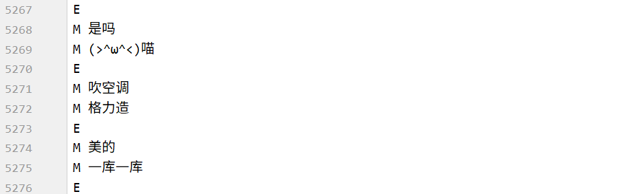
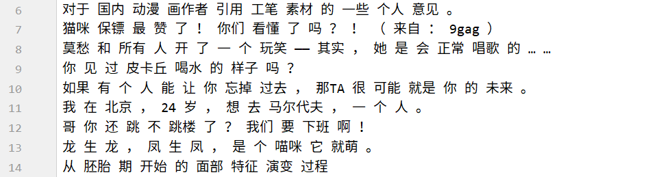
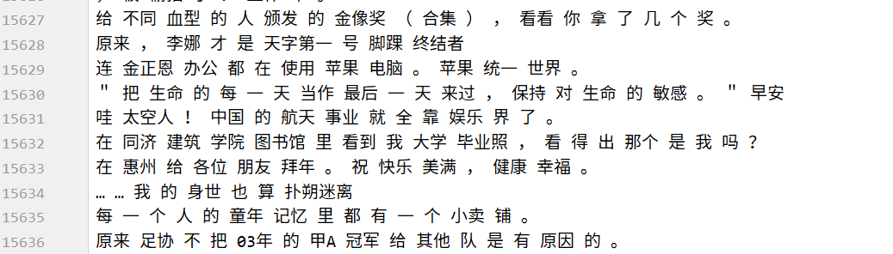
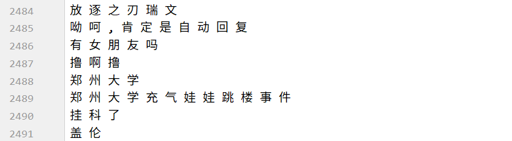

# Seq2Seq实现闲聊机器人

## 目标

1. 知道如何处理文本数据
2. 知道如何使用seq2seq完成闲聊机器人代码的编写


## 1. 准备训练数据

`单轮次`的聊天数据非常不好获取，所以这里我们从github上使用一些开放的数据集来训练我们的闲聊模型

数据地址：https://github.com/codemayq/chaotbot_corpus_Chinese

主要的数据有两个：

1. 小黄鸡的聊天语料：噪声很大
   - 
2. 微博的标题和评论：质量相对较高
   - 
   - 

## 2. 数据的处理和保存

由于数据中存到大量的噪声，可以对其进行基础的处理，然后分别把input和target使用两个文件保存，即input中的第N行尾问，target的第N行为答

后续可能我们可能会把单个字作为特征（存放在input_word.txt），也可能会把词语作为特征(input.txt)

### 2.1 小黄鸡的语料的处理

```python
def format_xiaohuangji_corpus(word=False):
    """处理小黄鸡的语料"""
    if word:
        corpus_path = "./chatbot/corpus/xiaohuangji50w_nofenci.conv"
        input_path = "./chatbot/corpus/input_word.txt"
        output_path = "./chatbot/corpus/output_word.txt"
    else:

        corpus_path = "./chatbot/corpus/xiaohuangji50w_nofenci.conv"
        input_path = "./chatbot/corpus/input.txt"
        output_path = "./chatbot/corpus/output.txt"

    f_input = open(input_path,"a")
    f_output = open(output_path,"a")
    pair = []
    for line in tqdm(open(corpus_path),ascii=True):
        if line.strip() == "E":
            if not pair:
                continue
            else:
                assert len(pair) == 2,"长度必须是2"
                if len(pair[0].strip())>=1 and len(pair[1].strip())>=1:
                    f_input.write(pair[0]+"\n")
                    f_output.write(pair[1]+"\n")
                pair = []
        elif line.startswith("M"):
            line = line[1:]
            if word:
                pair.append(" ".join(list(line.strip())))
            else:
                pair.append(" ".join(jieba_cut(line.strip())))

```

### 2.2 微博语料的处理

```python
def format_weibo(word=False):
    """
    微博数据存在一些噪声，未处理
    :return:
    """
    if word:
        origin_input = "./chatbot/corpus/stc_weibo_train_post"
        input_path = "./chatbot/corpus/input_word.txt"

        origin_output = "./chatbot/corpus/stc_weibo_train_response"
        output_path = "./chatbot/corpus/output_word.txt"

    else:
        origin_input = "./chatbot/corpus/stc_weibo_train_post"
        input_path = "./chatbot/corpus/input.txt"

        origin_output = "./chatbot/corpus/stc_weibo_train_response"
        output_path = "./chatbot/corpus/output.txt"

    f_input = open(input_path,"a")
    f_output = open(output_path, "a")
    with open(origin_input) as in_o,open(origin_output) as out_o:
        for _in,_out in tqdm(zip(in_o,out_o),ascii=True):
            _in = _in.strip()
            _out = _out.strip()

            if _in.endswith("）") or _in.endswith("」") or _in.endswith(")"):
                _in = re.sub("（.*）|「.*?」|\(.*?\)"," ",_in)
            _in = re.sub("我在.*?alink|alink|（.*?\d+x\d+.*?）|#|】|【|-+|_+|via.*?：*.*"," ",_in)

            _in = re.sub("\s+"," ",_in)
            if len(_in)<1 or len(_out)<1:
                continue

            if word:
                _in = re.sub("\s+","",_in)  #转化为一整行，不含空格
                _out = re.sub("\s+","",_out)
                if len(_in)>=1 and len(_out)>=1:
                    f_input.write(" ".join(list(_in)) + "\n")
                    f_output.write(" ".join(list(_out)) + "\n")
            else:
                if len(_in) >= 1 and len(_out) >= 1:
                    f_input.write(_in.strip()+"\n")
                    f_output.write(_out.strip()+"\n")

    f_input.close()
    f_output.close()
```

### 2.3 处理后的结果





### 3. 构造文本序列化和反序列化方法

和之前的操作相同，需要把文本能转化为数字，同时还需实现方法把数字转化为文本

```python
# word_sequence.py
import config
import pickle

class Word2Sequence():
    UNK_TAG = "UNK"
    PAD_TAG = "PAD"
    SOS_TAG = "SOS"
    EOS_TAG = "EOS"

    UNK = 0
    PAD = 1
    SOS = 2
    EOS = 3

    def __init__(self):
        self.dict = {
            self.UNK_TAG :self.UNK,
            self.PAD_TAG :self.PAD,
            self.SOS_TAG :self.SOS,
            self.EOS_TAG :self.EOS
        }
        self.count = {}
        self.fited = False

    def to_index(self,word):
        """word -> index"""
        assert self.fited == True,"必须先进行fit操作"
        return self.dict.get(word,self.UNK)

    def to_word(self,index):
        """index -> word"""
        assert self.fited , "必须先进行fit操作"
        if index in self.inversed_dict:
            return self.inversed_dict[index]
        return self.UNK_TAG

    def __len__(self):
        return len(self.dict)

    def fit(self, sentence):
        """
        :param sentence:[word1,word2,word3]
        :param min_count: 最小出现的次数
        :param max_count: 最大出现的次数
        :param max_feature: 总词语的最大数量
        :return:
        """
        for a in sentence:
            if a not in self.count:
                self.count[a] = 0
            self.count[a] += 1

        self.fited = True

    def build_vocab(self, min_count=1, max_count=None, max_feature=None):

        # 比最小的数量大和比最大的数量小的需要
        if min_count is not None:
            self.count = {k: v for k, v in self.count.items() if v >= min_count}
        if max_count is not None:
            self.count = {k: v for k, v in self.count.items() if v <= max_count}

        # 限制最大的数量
        if isinstance(max_feature, int):
            count = sorted(list(self.count.items()), key=lambda x: x[1])
            if max_feature is not None and len(count) > max_feature:
                count = count[-int(max_feature):]
            for w, _ in count:
                self.dict[w] = len(self.dict)
        else:
            for w in sorted(self.count.keys()):
                self.dict[w] = len(self.dict)

        # 准备一个index->word的字典
        self.inversed_dict = dict(zip(self.dict.values(), self.dict.keys()))

    def transform(self, sentence,max_len=None,add_eos=False):
        """
        实现吧句子转化为数组（向量）
        :param sentence:
        :param max_len:
        :return:
        """
        assert self.fited, "必须先进行fit操作"

        r = [self.to_index(i) for i in sentence]
        if max_len is not None:
            if max_len>len(sentence):
                if add_eos:
                    r+=[self.EOS]+[self.PAD for _ in range(max_len-len(sentence)-1)]
                else:
                    r += [self.PAD for _ in range(max_len - len(sentence))]
            else:
                if add_eos:
                    r = r[:max_len-1]
                    r += [self.EOS]
                else:
                    r = r[:max_len]
        else:
            if add_eos:
                r += [self.EOS]
        # print(len(r),r)
        return r

    def inverse_transform(self,indices):
        """
        实现从数组 转化为 向量
        :param indices: [1,2,3....]
        :return:[word1,word2.....]
        """
        sentence = []
        for i in indices:
            word = self.to_word(i)
            sentence.append(word)
        return sentence

#之后导入该word_sequence使用
word_sequence = pickle.load(open("./pkl/ws.pkl","rb")) if not config.use_word else pickle.load(open("./pkl/ws_word.pkl","rb"))


if __name__ == '__main__':
    from word_sequence import Word2Sequence
    from tqdm import tqdm
    import pickle

    word_sequence = Word2Sequence()
    #词语级别
    input_path = "../corpus/input.txt"
    target_path = "../corpus/output.txt"
    for line in tqdm(open(input_path).readlines()):
        word_sequence.fit(line.strip().split())
    for line in tqdm(open(target_path).readlines()):
        word_sequence.fit(line.strip().split())
	
    #使用max_feature=5000个数据
    word_sequence.build_vocab(min_count=5,max_count=None,max_feature=5000)
    print(len(word_sequence))
    pickle.dump(word_sequence,open("./pkl/ws.pkl","wb"))
```


### 4. 构建Dataset和DataLoader

创建`dataset.py`	文件，准备数据集

```python
import torch
import config
from torch.utils.data import Dataset,DataLoader
from word_sequence import word_sequence


class ChatDataset(Dataset):
    def __init__(self):
        super(ChatDataset,self).__init__()

        input_path = "../corpus/input.txt"
        target_path = "../corpus/output.txt"
        if config.use_word:
            input_path = "../corpus/input_word.txt"
            target_path = "../corpus/output_word.txt"

        self.input_lines = open(input_path).readlines()
        self.target_lines = open(target_path).readlines()
        assert len(self.input_lines) == len(self.target_lines) ,"input和target文本的数量必须相同"
    def __getitem__(self, index):
        input = self.input_lines[index].strip().split()
        target = self.target_lines[index].strip().split()
        if len(input) == 0 or len(target)==0:
            input = self.input_lines[index+1].strip().split()
            target = self.target_lines[index+1].strip().split()
        #此处句子的长度如果大于max_len，那么应该返回max_len
        return input,target,min(len(input),config.max_len),min(len(target),config.max_len)

    def __len__(self):
        return len(self.input_lines)

def collate_fn(batch):
    #1.排序
    batch = sorted(batch,key=lambda x:x[2],reverse=True)
    input, target, input_length, target_length = zip(*batch)

    # 2.进行padding的操作
    input = torch.LongTensor([word_sequence.transform(i, max_len=config.max_len) for i in input])
    target = torch.LongTensor([word_sequence.transform(i, max_len=config.max_len, add_eos=True) for i in target])
    input_length = torch.LongTensor(input_length)
    target_length = torch.LongTensor(target_length)

    return input, target, input_length, target_length

data_loader = DataLoader(dataset=ChatDataset(),batch_size=config.batch_size,shuffle=True,collate_fn=collate_fn,drop_last=True)

if __name__ == '__main__':
    for idx, (input, target, input_lenght, target_length) in enumerate(data_loader):
        print(idx)
        print(input)
        print(target)
        print(input_lenght)
        print(target_length)
```


## 5. 完成`encoder`编码器逻辑

```python
import torch.nn as nn
from word_sequence import word_sequence
import config


class Encoder(nn.Module):
    def __init__(self):
        super(Encoder,self).__init__()
        self.vocab_size = len(word_sequence)
        self.dropout = config.dropout
        self.embedding_dim = config.embedding_dim
        self.embedding = nn.Embedding(num_embeddings=self.vocab_size,embedding_dim=self.embedding_dim,padding_idx=word_sequence.PAD)
        self.gru = nn.GRU(input_size=self.embedding_dim,
                          hidden_size=config.hidden_size,
                          num_layers=1,
                          batch_first=True,
                          dropout=config.dropout)

    def forward(self, input,input_length):
        embeded = self.embedding(input)
        embeded = nn.utils.rnn.pack_padded_sequence(embeded,lengths=input_length,batch_first=True)

        #hidden:[1,batch_size,vocab_size]
        out,hidden = self.gru(embeded)
        out,outputs_length = nn.utils.rnn.pad_packed_sequence(out,batch_first=True,padding_value=word_sequence.PAD)
        #hidden [1,batch_size,hidden_size]
        return out,hidden
```

## 6. 完成`decoder`解码器的逻辑

```python
import torch
import torch.nn as nn
import config
import random
import torch.nn.functional as F
from word_sequence import word_sequence

class Decoder(nn.Module):
    def __init__(self):
        super(Decoder,self).__init__()
        self.max_seq_len = config.max_len
        self.vocab_size = len(word_sequence)
        self.embedding_dim = config.embedding_dim
        self.dropout = config.dropout

        self.embedding = nn.Embedding(num_embeddings=self.vocab_size,embedding_dim=self.embedding_dim,padding_idx=word_sequence.PAD)
        self.gru = nn.GRU(input_size=self.embedding_dim,
                          hidden_size=config.hidden_size,
                          num_layers=1,
                          batch_first=True,
                          dropout=self.dropout)
        self.log_softmax = nn.LogSoftmax()

        self.fc = nn.Linear(config.hidden_size,self.vocab_size)

    def forward(self, encoder_hidden,target,target_length):
        # encoder_hidden [batch_size,hidden_size]
        # target [batch_size,seq-len]

        decoder_input = torch.LongTensor([[word_sequence.SOS]]*config.batch_size).to(config.device)
        decoder_outputs = torch.zeros(config.batch_size,config.max_len,self.vocab_size).to(config.device) #[batch_size,seq_len,14]

        decoder_hidden = encoder_hidden #[batch_size,hidden_size]

        for t in range(config.max_len):
            decoder_output_t , decoder_hidden = self.forward_step(decoder_input,decoder_hidden)
            decoder_outputs[:,t,:] = decoder_output_t
            value, index = torch.topk(decoder_output_t, 1) # index [batch_size,1]
            decoder_input = index
        return decoder_outputs,decoder_hidden

    def forward_step(self,decoder_input,decoder_hidden):
        """
        :param decoder_input:[batch_size,1]
        :param decoder_hidden: [1,batch_size,hidden_size]
        :return: out:[batch_size,vocab_size],decoder_hidden:[1,batch_size,didden_size]
        """
        embeded = self.embedding(decoder_input)  #embeded: [batch_size,1 , embedding_dim]
        out,decoder_hidden = self.gru(embeded,decoder_hidden) #out [1, batch_size, hidden_size]
        out = out.squeeze(0)
        out = F.log_softmax(self.fc(out),dim=-1)#[batch_Size, vocab_size]
        out = out.squeeze(1)
        # print("out size:",out.size(),decoder_hidden.size())
        return out,decoder_hidden
```

## 7.完成seq2seq的模型

```python
import torch
import torch.nn as nn

class Seq2Seq(nn.Module):
    def __init__(self,encoder,decoder):
        super(Seq2Seq,self).__init__()
        self.encoder = encoder
        self.decoder = decoder

    def forward(self, input,target,input_length,target_length):
        encoder_outputs,encoder_hidden = self.encoder(input,input_length)
        decoder_outputs,decoder_hidden = self.decoder(encoder_hidden,target,target_length)
        return decoder_outputs,decoder_hidden

    def evaluation(self,inputs,input_length):
        encoder_outputs,encoder_hidden = self.encoder(inputs,input_length)
        decoded_sentence = self.decoder.evaluation(encoder_hidden)
        return decoded_sentence
```

## 8. 完成训练逻辑

为了加速训练，可以考虑在gpu上运行，那么在我们自顶一个所以的tensor和model都需要转化为CUDA支持的类型。

当前的数据量为500多万条，在GTX1070（8G显存）上训练，大概需要90分一个epoch，耐心的等待吧

```python
import torch
import config
from torch import optim
import torch.nn as nn
from encoder import Encoder
from decoder import Decoder
from seq2seq import Seq2Seq
from dataset import data_loader as train_dataloader
from word_sequence import word_sequence

encoder = Encoder()
decoder = Decoder()
model = Seq2Seq(encoder,decoder)

#device在config文件中实现
model.to(config.device)

print(model)

model.load_state_dict(torch.load("model/seq2seq_model.pkl"))
optimizer =  optim.Adam(model.parameters())
optimizer.load_state_dict(torch.load("model/seq2seq_optimizer.pkl"))
criterion= nn.NLLLoss(ignore_index=word_sequence.PAD,reduction="mean")

def get_loss(decoder_outputs,target):
    target = target.view(-1) #[batch_size*max_len]
    decoder_outputs = decoder_outputs.view(config.batch_size*config.max_len,-1)
    return criterion(decoder_outputs,target)


def train(epoch):
    for idx,(input,target,input_length,target_len) in enumerate(train_dataloader):
        input = input.to(config.device)
        target = target.to(config.device)
        input_length = input_length.to(config.device)
        target_len = target_len.to(config.device)

        optimizer.zero_grad()
        ##[seq_len,batch_size,vocab_size] [batch_size,seq_len]
        decoder_outputs,decoder_hidden = model(input,target,input_length,target_len)
        loss = get_loss(decoder_outputs,target)
        loss.backward()
        optimizer.step()

        print('Train Epoch: {} [{}/{} ({:.0f}%)]\tLoss: {:.6f}'.format(
            epoch, idx * len(input), len(train_dataloader.dataset),
                   100. * idx / len(train_dataloader), loss.item()))

        torch.save(model.state_dict(), "model/seq2seq_model.pkl")
        torch.save(optimizer.state_dict(), 'model/seq2seq_optimizer.pkl')

if __name__ == '__main__':
    for i in range(10):
        train(i)
```

训练10个epoch之后的效果如下,可以看出损失依然很高：

```
Train Epoch: 9 [2444544/4889919 (50%)]	Loss: 4.923604
Train Epoch: 9 [2444800/4889919 (50%)]	Loss: 4.364594
Train Epoch: 9 [2445056/4889919 (50%)]	Loss: 4.613254
Train Epoch: 9 [2445312/4889919 (50%)]	Loss: 4.143538
Train Epoch: 9 [2445568/4889919 (50%)]	Loss: 4.412729
Train Epoch: 9 [2445824/4889919 (50%)]	Loss: 4.516526
Train Epoch: 9 [2446080/4889919 (50%)]	Loss: 4.124945
Train Epoch: 9 [2446336/4889919 (50%)]	Loss: 4.777015
Train Epoch: 9 [2446592/4889919 (50%)]	Loss: 4.358538
Train Epoch: 9 [2446848/4889919 (50%)]	Loss: 4.513412
Train Epoch: 9 [2447104/4889919 (50%)]	Loss: 4.202757
Train Epoch: 9 [2447360/4889919 (50%)]	Loss: 4.589584
```


## 9.小结

效果不好