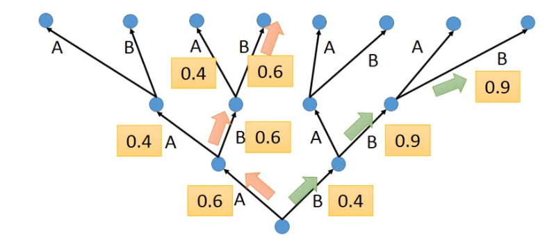
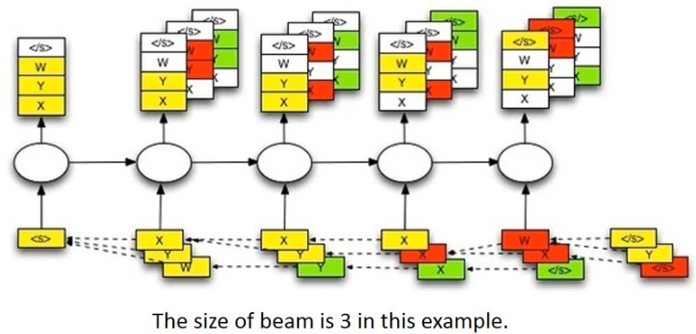

# Beam Search

## 目标

1. 知道beam search的概念和原理
2. 能够在代码中使用Beam search 完成预测过程


## 1. Beam Search的介绍

> 在进行模型评估的过程中，每次我们选择概率最大的token id作为输出，那么整个输出的句子的概率就是最大的么？
>
> 

`Beam search`的又被称作`束集搜索`，是一种seq2seq中用来优化输出结果的算法(不在训练过程中使用)。

例如：传统的获取解码器输出的过程中，每次只选择概率最大的那个结果，作为当前时间步的输出，等到输出结束，我们会发现，整个句子可能并不通顺。虽然在每一个时间步上的输出确实是概率最大的，但是整体的概率确不一定最大的，我们经常把它叫做`greedy search[贪心算法]`

为了解决上述的问题，可以考虑计算全部的输出的概率乘积，选择最大的哪一个，但是这样的话，意味着如果句子很长，候选词很多，那么需要保存的数据就会非常大，需要计算的数据量就很大

那么Beam Search 就是介于上述两种方法的一个这种的方法，假设Beam width=2，表示每次保存的最大的概率的个数，这里每次保存两个，在下一个时间步骤一样，也是保留两个，这样就可以达到约束搜索空间大小的目的，从而提高算法的效率。

beam width =1 时，就是贪心算法，beam width=候选词的时候，就是计算全部的概率。beam width 是一个超参数。

比如在下图中:

使用一个树状图来表示每个time step的可能输出，其中的数字表示是条件概率

黄色的箭头表示的是一种greedy search，概率并不是最大的

如果把beam width设置为2，那么后续可以找到绿色路径的结果，这个结果是最大的


下图是要给beam width=3的例子

1. 首先输入`start token <s>`,然后得到四个输出(这里假设一个就四个输出:`x,y,z,</s>`)，选择概率最大三个，x,y,w
2. 然后分别把x,y,z放到下一个time step中作为输入，分别得到三个不同的输出，找到三个输出中概率最大的三个，x,y,y
3. 继续重复上述步骤，直到获得结束符(概率最大)或者是达到句子的最大长度，那么此时选择概率乘积最大的一个。
4. 拼接整个路径上概率最大的所有结果，比如这里可能是`<s>,y,y,x,w,</s>`




## 2. Beam serach的实现

在上述描述的思路中，我们需要注意以下几个内容：

1. 数据该如何保存，每一次的输出的最大的beam width个结果，和之后之前的结果该如何保存
2. 保存了之后的概率应该如何比较大小，保留下概率最大的三个
3. 不能够仅仅只保存当前概率最大的信息，还需要有当前概率最大的三个中，前面的路径的输出结果

### 2.1 数据结构-堆-的认识

对于上面所说的，保留有限个数据，同时需要根据大小来保留，可以使用一种带有优先级的数据结构来实现，这里我们可以使用`堆`这种数据结构

`堆`是一种优先级的队列，但是他其实并不是队列，我们常说的队列都是`先进先出或者是先进后出`，但是`堆`只根据优先级的高低来取出数据。

和`堆`在一起的另外一种数据结构叫做`栈`,有入栈和出栈的操作，可以理解为是一种先进后出的数据结构，关于栈，大家可以下来在了解。

在python自带的模块中，有一个叫做`heapq`的模块，提供了堆所有的方法。通过下面的代码我们来了解下heapq的使用方法

```python
my_heap = [] #使用列表保存数据

 #往列表中插入数据，优先级使用插入的内容来表示，就是一个比较大小的操作，越大优先级越高
heapq.heappush(my_heap,[29,True,"xiaohong"]) 
heapq.heappush(my_heap,[28,False,"xiaowang"])
heapq.heappush(my_heap,[29,False,"xiaogang"])

for i in range(3):
    ret= heapq.heappop(my_heap)  #pop操作，优先级最小的数据
    print(ret)
    
#输出如下：
[28, False, 'xiaowang']
[29, False, 'xiaogang']
[29, True, 'xiaohong']
```

可以发现，输出的顺序并不是数据插入的顺序，而是根据其优先级，从小往大pop（False<True）。

### 2.2 使用堆来实现beam search

为了实现数据的的保存，我们可以把beam search中的数据保存在堆中，同时在往这个堆中添加数据的同时，判断数据的个数，仅仅保存beam width个数据

```python
class Beam:
    def __init__(self):
        self.heap = list() #保存数据的位置
        self.beam_width = config.beam_width #保存数据的总数

    def add(self,probility,complete,seq,decoder_input,decoder_hidden):
        """
        添加数据，同时判断总的数据个数，多则删除
        :param probility: 概率乘积
        :param complete: 最后一个是否为EOS
        :param seq: list，所有token的列表
        :param decoder_input: 下一次进行解码的输入，通过前一次获得
        :param decoder_hidden: 下一次进行解码的hidden，通过前一次获得
        :return:
        """
        heapq.heappush(self.heap,[probility,complete,seq,decoder_input,decoder_hidden])
        #判断数据的个数，如果大，则弹出。保证数据总个数小于等于3
        if len(self.heap)>self.beam_width:
            heapq.heappop(self.heap)

    def __iter__(self):#让该beam能够被迭代
        return iter(self.heap)
```

实现方法，完成模型eval过程中的beam search搜索

思路：

1. 构造`<SOS>`开始符号等第一次输入的信息，保存在堆中
2. 取出堆中的数据，进行forward_step的操作，获得当前时间步的output，hidden
3. 从output中选择topk（k=beam width）个输出，作为下一次的input
4. 把下一个时间步骤需要的输入等数据保存在一个新的堆中
5. 获取新的堆中的优先级最高（概率最大）的数据，判断数据是否是EOS结尾或者是否达到最大长度，如果是，停止迭代
6. 如果不是，则重新遍历新的堆中的数据


代码如下

```python
# decoder中的新方法
def evaluatoin_beamsearch_heapq(self,encoder_outputs,encoder_hidden):
    """使用 堆 来完成beam search，对是一种优先级的队列，按照优先级顺序存取数据"""

    batch_size = encoder_hidden.size(1)
    #1. 构造第一次需要的输入数据，保存在堆中
    decoder_input = torch.LongTensor([[word_sequence.SOS] * batch_size]).to(config.device)
    decoder_hidden = encoder_hidden #需要输入的hidden

    prev_beam = Beam()
    prev_beam.add(1,False,[decoder_input],decoder_input,decoder_hidden)
    while True:
        cur_beam = Beam()
        #2. 取出堆中的数据，进行forward_step的操作，获得当前时间步的output，hidden
        #这里使用下划线进行区分
        for _probility,_complete,_seq,_decoder_input,_decoder_hidden in prev_beam:
            #判断前一次的_complete是否为True，如果是，则不需要forward
            #有可能为True，但是概率并不是最大
            if _complete == True:
                cur_beam.add(_probility,_complete,_seq,_decoder_input,_decoder_hidden)
            else:
                decoder_output_t, decoder_hidden,_ = self.forward_step(_decoder_input, _decoder_hidden,encoder_outputs)
                value, index = torch.topk(decoder_output_t, config.beam_width)  # [batch_size=1,beam_widht=3]
             #3. 从output中选择topk（k=beam width）个输出，作为下一次的input
            	for m, n in zip(value[0], index[0]):
                    decoder_input = torch.LongTensor([[n]]).to(config.device)
                    seq = _seq + [n]
                    probility = _probility * m
                    if n.item() == word_sequence.EOS:
                    	complete = True
                    else:
                        complete = False

                 	#4. 把下一个实践步骤需要的输入等数据保存在一个新的堆中
                	  cur_beam.add(probility,complete,seq,
                                   decoder_input,decoder_hidden)
          #5. 获取新的堆中的优先级最高（概率最大）的数据，判断数据是否是EOS结尾或者是否达到最大长度，如果是，停止迭代
          best_prob,best_complete,best_seq,_,_ = max(cur_beam)
         if best_complete == True or len(best_seq)-1 == config.max_len: #减去sos
            return self._prepar_seq(best_seq)
         else:
            #6. 则重新遍历新的堆中的数据
            prev_beam = cur_beam
                                    
      def _prepar_seq(self,seq):#对结果进行基础的处理，共后续转化为文字使用
        if seq[0].item() == word_sequence.SOS:
            seq=  seq[1:]
        if  seq[-1].item() == word_sequence.EOS:
            seq = seq[:-1]
        seq = [i.item() for i in seq]
        return seq
```

### 2.3 修改seq2seq

在seq2seq中使用evaluatoin_beamsearch_heapq查看效果，会发现使用beam search的效果比单独使用attention的效果更好

使用小黄鸡语料（50万个问答），单个字作为token，5个epoch之后的训练结果，左边为问，右边是回答

```python
你在干什么 >>>>> 你想干啥？
你妹 >>>>> 不是我
你叫什么名字 >>>>> 你猜
你个垃圾 >>>>> 你才是，你
你是傻逼 >>>>> 是你是傻
笨蛋啊 >>>>> 我不是，你
```
