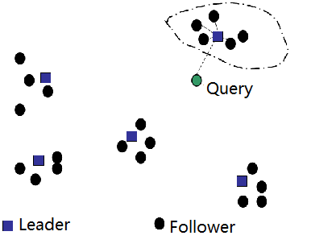

# 问答机器人的召回

## 目标

1. 知道召回的目的
2. 能够说出召回的流程
3. 能够优化基础的召回逻辑


## 1. 召回的流程

流程如下：

1. 准备数据，问答对的数据等
2. 问题转化为向量
3. 计算相似度


## 2. 对现有问答对的准备

这里说的问答对，是带有标准答案的问题，后续命中问答对中的问题后，会返回该问题对应的答案

为了后续使用方便，我们可以把现有问答对的处理成如下的格式，可以考虑存入数据库或者本地文件：

```python
{
    "问题1":{
        "主体":["主体1","主体3","主体3"..],
        "问题1分词后的句子":["word1","word2","word3"...],
        "答案":"答案"
    },
    "问题2":{
        ...
    }
}
```

代码如下：

```python
# lib/get_qa_dcit.py
def get_qa_dict():
    chuanzhi_q_path = "./问答对/Q.txt"
    chuanzhi_a_path = "./问答对/A.txt"
    QA_dict = {}
    for q,a in zip(open(chuanzhi_q_path).readlines(),open(chuanzhi_a_path).readlines()):
        QA_dict[q.strip()] = {}
        QA_dict[q.strip()]["ans"] = a.strip()
        QA_dict[q.strip()]["entity"] = sentence_entity(q.strip())[-1]

    #准备短问答的问题
    python_duan_path = "./data/Python短问答-11月汇总.xlsx"

    ret = pd.read_excel(python_duan_path)
    column_list = ret.columns
    assert '问题' in column_list and "答案" in column_list, "excel 中必须包含问题和答案"
    for q, a in zip(ret["问题"], ret["答案"]):
        q = re.sub("\s+", " ", q)
        QA_dict[q.strip()] = {}
        QA_dict[q.strip()]["ans"] = a
        cuted,entiry = sentence_entity(q.strip())[-1]
        QA_dict[q.strip()]["entity"] = entiry
        QA_dict[q.strip()]["q_cuted"] = cuted

    return QA_dict

QA_dict = get_qa_dict()
```

## 3. 把问题转化为向量

把问答对中的问题，和用户输出的问题，转化为向量，为后续计算相似度做准备。

这里，我们使用tfidf对问答对中的问题进行处理，转化为向量矩阵。

> TODO，使用单字，使用n-garm，使用BM25，使用word2vec等，让其结果更加准确

```python
from sklearn.feature_extraction.text import TfidfVectorizer
from lib import QA_dict

def build_q_vectors():
    """对问题建立索引"""
    lines_cuted= [q["q_cuted"] for q in QA_dict]
    tfidf_vectorizer = TfidfVectorizer()
    features_vec = tfidf_vectorizer.fit_transform(lines_cuted)
    #返回tfidf_vectorizer，后续还需要对用户输入的问题进行同样的处理
	return tfidf_vectorizer,features_vec，lines_cuted
```

## 4. 计算相似度

思路很简单。对用户输入的问题使用`tfidf_vectorizer`进行处理，然后和`features_vec`中的每一个结果进行计算，获取相似度。

但是由于耗时可能会很久，所以考虑使用其他方法来实现

### 4.1 `pysparnn`的介绍

官方地址：`https://github.com/facebookresearch/pysparnn`

`pysparnn`是一个对sparse数据进行相似邻近搜索的python库，这个库是用来实现 高维空间中寻找最相似的数据的。

### 4.2 `pysparnn`的使用方法

pysparnn的使用非常简单，仅仅需要以下步骤，就能够完成从高维空间中寻找相似数据的结果

1. 准备源数据和待搜索数据
2. 对源数据进行向量化，把向量结果和源数据构造搜索的索引
3. 对待搜索的数据向量化，传入索引，获取结果

```python
import pysparnn.cluster_index as ci

from sklearn.feature_extraction.text import TfidfVectorizer

#1. 原始数据
data = [
    'hello world',
    'oh hello there',
    'Play it',
    'Play it again Sam',
]  

#2. 原始数据向量化

tv = TfidfVectorizer()
tv.fit(data)

features_vec = tv.transform(data)

# 原始数据构造索引
cp = ci.MultiClusterIndex(features_vec, data)

# 待搜索的数据向量化
search_data = [
    'oh there',
    'Play it again Frank'
]

search_features_vec = tv.transform(search_data)

#3. 索引中传入带搜索数据，返回结果
cp.search(search_features_vec, k=1, k_clusters=2, return_distance=False)
>> [['oh hello there'], ['Play it again Sam']]
```

使用注意点：

1. 构造索引是需要传入向量和原数据，最终的结果会返回源数据
2. 传入待搜索的数据时，需要传入一下几个参数：
   1. `search_features_vec`：搜索的句子的向量
   2. `k`:最大的几个结果，k=1，返回最大的一个
   3. `k_clusters`:对数据分为多少类进行搜索
   4. `return_distance`:是否返回距离

### 4.3 使用pysparnn完成召回的过程

```python

#构造索引
cp = ci.MultiClusterIndex(features_vec, lines_cuted)

#对用户输入的句子进行向量化
search_vec = tfidf_vec.transform(ret)
#搜索获取结果，返回最大的8个数据，之后根据`main_entiry`进行过滤结果
cp_search_list = cp.search(search_vec, k=8, k_clusters=10, return_distance=True)

exist_same_entiry = False
search_lsit = []
for _temp_call_line in cp_search_list[0]:
    cur_entity = QA_dict[_temp_call_line[1]]["main_entity"]
    if len(set(main_entity) & set(cur_entity))>0:  #命名体的集合存在交集的时候返回
        exist_same_entiry  = True
        search_lsit.append(_temp_call_line[1])

if exist_same_entiry: #存在相同的主体的时候
    return search_lsit
else:
    # print(cp_search_list)
    return [i[1] for i in cp_search_list[0]]

```

在这个过程中，需要注意，提前把`cp,tfidf_vec`等内容提前准备好，而不应该在每次接收到用户的问题之后重新生成一遍，否则效率会很低

### 4.4 `pysparnn`的原理介绍

参考地址：`https://nlp.stanford.edu/IR-book/html/htmledition/cluster-pruning-1.html`

前面我们使用的`pysparnn`使用的是一种`cluster pruning(簇修剪)`的技术，即，开始的时候对数据进行聚类，后续再有限个类别中进行数据的搜索，根据计算的余弦相似度返回结果。

数据预处理过程如下：

1. 随机选择$\sqrt{N}$个样本作为leader
2. 选择非leader的数据(follower),使用余弦相似度计算找到最近的leader

当获取到一个问题q的时候，查询过程：

1. 计算每个leader和q的相似度，找到最相似的leader
2. 然后计算问题q和leader所在簇的相似度，找到最相似的k个，作为最终的返回结果




在上述的过程中，可以设置两个大于0的数字`b1和b2`

- b1表示在`数据预处理`阶段，每个follower选择b1个最相似的leader，而不是选择单独一个lader，这样不同的簇是有数据交叉的；
- b2表示在查询阶段，找到最相似的b2个leader，然后再计算不同的leader中下的topk的结果

前面的描述就是b1=b2=1的情况，通过增加`b1和b2`的值，我们能够有更大的机会找到更好的结果，但是这样会需要更加大量的计算。

在pysparnn中实例化索引的过程中

 即：`ci.MultiClusterIndex(features, records_data, num_indexes)`中，`num_indexes`能够设置b1的值，默认为2。

在搜索的过程中，`cp.search(search_vec, k=8, k_clusters=10, return_distance=True,num_indexes)`，`num_Indexes`可以设置b2的值，默认等于b1的值。