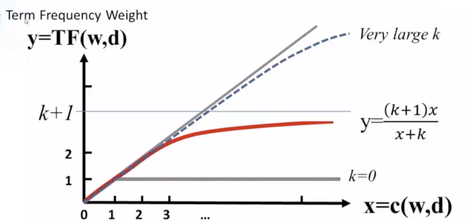
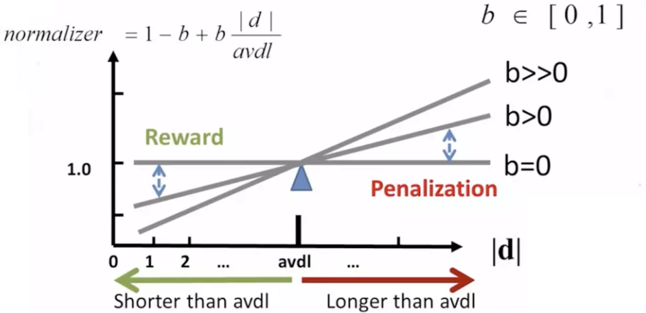

# 召回过程优化

## 目标

1. 知道优化的方法和思路
2. 知道BM25方法的原理和实现
3. 能够使用word2vector完成优化过程

## 1. 优化思路

前面的学习，我们能够返回相似的召回结果，但是，如何让这些结果更加准确呢？

我们可以从下面的角度出发：

1. tfidf使用的是词频和整个文档的词语，如果用户问题的某个词语没有出现过，那么此时，计算出来的相似度可能就不准确。该问题的解决思路：
   - 对用户输入的问题进行文本的对齐，比如，使用训练好的word2vector，往句子中填充非主语的其他词语的相似词语。例如`python 好学 么 -->填充后是 ：python 好学 么 简单 难 嘛 `，这里假设word2vector同学会了`好学，简单，难`他们之间是相似的
   - 使用word2vector对齐的好处除了应对未出现的词语，还能够提高主语的重要程度，让主语位置的tfidf的值更大，从而让相似度更加准确
2. tfidf是一个词袋模型，没有考虑词和词之间的顺序
   - 使用n-garm和词一起作为特征，转化为特征向量
3. 不去使用tfidf处理句子得到向量。
   - 使用BM25算法
   - 或者 使用fasttext、word2vector，把句子转化为向

## 2. 通过BM25算法代替TFIDF

### 2.1 BM25算法原理

BM25(BM=best matching)是TDIDF的优化版本，首先我们来看看TFIDF是怎么计算的
$$
tfidf_i = tf*idf = \frac{词i的数量}{词语总数}*log\frac{总文档数}{包含词i的文档数}
$$
其中tf称为词频，idf为逆文档频率

那么BM25是如何计算的呢？
$$
BM25(i) = \frac{词i的数量}{总词数}*\frac{(k+1)C}{C+k(1-b+b\frac{|d|}{avdl}）}*log(\frac{总文档数}{包含i的文档数}) \\
C = tf=\frac{词i的数量}{总词数},k>0,b\in [0,1]，d为文档i的长度，avdl是文档平均长度
$$
大家可以看到，BM25和tfidf的计算结果很相似，唯一的区别在于中多了一项，这一项是用来对tf的结果进行的一种变换。

把$1-b+b\frac{d}{avdl}$中的b看成0，那么此时中间项的结果为$\frac{(k+1)tf}{k+tf}$，通过设置一个k，就能够保证其最大值为$1​$，达到限制tf过大的目的。

即：
$$
\begin{align}
&\frac{(k+1)tf}{k+tf}= \frac{k+1}{1+\frac{k}{tf}} \qquad \qquad \qquad,上下同除tf
\end{align}
$$
k不变的情况下，上式随着tf的增大而增大，上限为k+1,但是增加的程度会变小，如下图所示。

在一个句子中，某个词重要程度应该是随着词语的数量逐渐衰减的，所以中间项对词频进行了惩罚，随着次数的增加，影响程度的增加会越来越小。通过设置k值，能够保证其最大值为k+1，`k往往取值1.2`。

其变化如下图（无论k为多少，中间项的变化程度会随着次数的增加，越来越小）：



同时$1-b+b\frac{d}{avdl}​$的作用是用来对文本的长度进行归一化。

例如在考虑整个句子的tdidf的时候，如果句子的长度太短，那么计算的总的tdidf的值是要比长句子的tdidf的值要低的。所以可以考虑对句子的长度进行归一化处理。

可以看到，当句子的长度越短，$1-b+b\frac{|d|}{avdl}$的值是越小，作为分母的位置，会让整个第二项越大，从而达到提高短文本句子的BM25的值的效果。当b的值为0，可以禁用归一化，`b往往取值0.75`

其变化效果如下：



### 2.2 BM25算法实现

通过前面的学习，我们知道其实BM25和Tfidf的区别不大，所以我们可以在之前sciket-learn的TfidfVectorizer基础上进行修改，获取我们的BM25的计算结果，主要也是修改其中的`fit`方法和`transform`方法

在sklearn的`TfidfVectorizer中`，首先接受参数，其次会调用`TfidfTransformer`来完成其他方法的调用

1. 继承TfidfVectorizer完成 参数的接受

   ```python
   
   from sklearn.feature_extraction.text import TfidfVectorizer,TfidfTransformer,_document_frequency
   from sklearn.base import BaseEstimator,TransformerMixin
   from sklearn.preprocessing import normalize
   from sklearn.utils.validation import check_is_fitted
   import numpy as np
   import scipy.sparse as sp
   
   class Bm25Vectorizer(CountVectorizer):
       def __init__(self,k=1.2,b=0.75, norm="l2", use_idf=True, smooth_idf=True,sublinear_tf=False,*args,**kwargs):
           super(Bm25Vectorizer,self).__init__(*args,**kwargs)
           self._tfidf = Bm25Transformer(k=k,b=b,norm=norm, use_idf=use_idf,
                                          smooth_idf=smooth_idf,
                                          sublinear_tf=sublinear_tf)
   
       @property
       def k(self):
           return self._tfidf.k
   
       @k.setter
       def k(self, value):
           self._tfidf.k = value
   
       @property
       def b(self):
           return self._tfidf.b
   
       @b.setter
       def b(self, value):
           self._tfidf.b = value
   
       def fit(self, raw_documents, y=None):
           """Learn vocabulary and idf from training set.
           """
           X = super(Bm25Vectorizer, self).fit_transform(raw_documents)
           self._tfidf.fit(X)
           return self
   
       def fit_transform(self, raw_documents, y=None):
           """Learn vocabulary and idf, return term-document matrix.
           """
           X = super(Bm25Vectorizer, self).fit_transform(raw_documents)
           self._tfidf.fit(X)
           return self._tfidf.transform(X, copy=False)
   
       def transform(self, raw_documents, copy=True):
           """Transform documents to document-term matrix.
           """
           check_is_fitted(self, '_tfidf', 'The tfidf vector is not fitted')
   
           X = super(Bm25Vectorizer, self).transform(raw_documents)
           return self._tfidf.transform(X, copy=False)
   ```

   

2. 完成自己的`Bm25transformer`,只需要再原来基础的代码上进心修改部分即可。sklearn中的转换器类的实现要求，不能直接继承已有的转换器类

   ```python
   
   class Bm25Transformer(BaseEstimator, TransformerMixin):
   
       def __init__(self,k=1.2,b=0.75, norm='l2', use_idf=True, smooth_idf=True,
                    sublinear_tf=False):
           self.k = k
           self.b = b
           ##################以下是TFIDFtransform代码##########################
           self.norm = norm
           self.use_idf = use_idf
           self.smooth_idf = smooth_idf
           self.sublinear_tf = sublinear_tf
   
       def fit(self, X, y=None):
           """Learn the idf vector (global term weights)
   
           Parameters
           ----------
           X : sparse matrix, [n_samples, n_features]
               a matrix of term/token counts
           """
           X = X.toarray()
           self.avdl = X.sum()/X.shape[0] #句子的平均长度
           # print("原来的fit的数据：\n",X)
   
           #计算每个词语的tf的值
           self.tf = X.sum(0)/X.sum()  #[M] #M表示总词语的数量
           self.tf = self.tf.reshape([1,self.tf.shape[0]]) #[1,M]
           # print("tf\n",self.tf)
           ##################以下是TFIDFtransform代码##########################
           if not sp.issparse(X):
               X = sp.csc_matrix(X)
           if self.use_idf:
               n_samples, n_features = X.shape
               df = _document_frequency(X)
   
               # perform idf smoothing if required
               df += int(self.smooth_idf)
               n_samples += int(self.smooth_idf)
   
               # log+1 instead of log makes sure terms with zero idf don't get
               # suppressed entirely.
               idf = np.log(float(n_samples) / df) + 1.0
               self._idf_diag = sp.spdiags(idf, diags=0, m=n_features,
                                           n=n_features, format='csr')
   
           return self
   
       def transform(self, X, copy=True):
           """Transform a count matrix to a tf or tf-idf representation
   
           Parameters
           ----------
           X : sparse matrix, [n_samples, n_features]
               a matrix of term/token counts
   
           copy : boolean, default True
               Whether to copy X and operate on the copy or perform in-place
               operations.
   
           Returns
           -------
           vectors : sparse matrix, [n_samples, n_features]
           """
    		########### 计算中间项  ###############
           cur_tf = np.multiply(self.tf, X.toarray()) #[N,M] #N表示数据的条数，M表示总词语的数量
           norm_lenght = 1 - self.b + self.b*(X.toarray().sum(-1)/self.avdl) #[N] #N表示数据的条数
           norm_lenght = norm_lenght.reshape([norm_lenght.shape[0],1]) #[N,1]
           X = (self.k+1)*cur_tf /(cur_tf +self.k*norm_lenght)
           ############# 结算结束  ################
   
           if hasattr(X, 'dtype') and np.issubdtype(X.dtype, np.floating):
               # preserve float family dtype
               X = sp.csr_matrix(X, copy=copy)
           else:
               # convert counts or binary occurrences to floats
               X = sp.csr_matrix(X, dtype=np.float64, copy=copy)
   
           n_samples, n_features = X.shape
   
           if self.sublinear_tf:
               np.log(X.data, X.data)
               X.data += 1
           if self.use_idf:
               check_is_fitted(self, '_idf_diag', 'idf vector is not fitted')
   
               expected_n_features = self._idf_diag.shape[0]
               if n_features != expected_n_features:
                   raise ValueError("Input has n_features=%d while the model"
                                    " has been trained with n_features=%d" % (
                                        n_features, expected_n_features))
               # *= doesn't work
               X = X * self._idf_diag
   
           if self.norm:
               X = normalize(X, norm=self.norm, copy=False)
   
           return X
   
       @property
       def idf_(self):
           ##################以下是TFIDFtransform代码##########################
           # if _idf_diag is not set, this will raise an attribute error,
           # which means hasattr(self, "idf_") is False
           return np.ravel(self._idf_diag.sum(axis=0))
   
   ```

   完整代码参考：`https://github.com/SpringMagnolia/Bm25Vectorzier/blob/master/BM25Vectorizer.py`

3. 测试简单使用，观察和tdidf的区别：

   ```python
   from BM25Vectorizer import Bm25Vectorizer
   from sklearn.feature_extraction.text import TfidfVectorizer
   
   
   if __name__ == '__main__':
       # format_weibo(word=False)
       # format_xiaohuangji_corpus(word=True)
       bm_vec = Bm25Vectorizer()
       tf_vec = TfidfVectorizer()
       # 1. 原始数据
       data = [
           'hello world',
           'oh hello there',
           'Play it',
           'Play it again Sam,24343,123',
       ]
   
       # 2. 原始数据向量化
       bm_vec.fit(data)
       tf_vec.fit(data)
       features_vec_bm = bm_vec.transform(data)
       features_vec_tf = tf_vec.transform(data)
       print("Bm25 result:",features_vec_bm.toarray())
       print("*"*100)
       print("Tfidf result:",features_vec_tf.toarray())
   ```

   

   输出如下：

   ```python
   Bm25 result: [[0.         0.         0.         0.47878333 0.         0.
     0.         0.         0.         0.8779331 ]
    [0.         0.         0.         0.35073401 0.         0.66218791
     0.         0.         0.66218791 0.        ]
    [0.         0.         0.         0.         0.70710678 0.
     0.70710678 0.         0.         0.        ]
    [0.47038081 0.47038081 0.47038081 0.         0.23975776 0.
     0.23975776 0.47038081 0.         0.        ]]
   **********************************************************************************
   Tfidf result: [[0.         0.         0.         0.6191303  0.         0.
     0.         0.         0.         0.78528828]
    [0.         0.         0.         0.48693426 0.         0.61761437
     0.         0.         0.61761437 0.        ]
    [0.         0.         0.         0.         0.70710678 0.
     0.70710678 0.         0.         0.        ]
    [0.43671931 0.43671931 0.43671931 0.         0.34431452 0.
     0.34431452 0.43671931 0.         0.        ]]
   
   ```

   ### 2.3 修改之前的召回代码

   修改之前召回的代码只需要把调用tfidfvectorizer改成调用Bm25vectorizer

## 3. 使用Fasttext实现获取句子向量

### 3.1 基础方法介绍

这里我们可以使用fasttext，word2vector等方式实现获取词向量，然后对一个句子中的所有词语的词向量进行平均，获取整个句子的向量表示，即`sentence Vector`，该实现方法在fasttext和Word2vector中均有实现，而且通过参数的控制，实现N-garm的效果

假设我们有文本`a.txt`如下：

```text
我 很 喜欢 她 
今天 天气 不错
我 爱 深度学习
```


那么我们可以实现获取句子向量的方法如下

```python
from fastText import FastText
#训练模型，设置n-garm=2
model = FastText.train_unsupervised(input="./a.txt",minCount=1,wordNgrams=2)
#获取句子向量，是对词向量的平均
model.get_sentence_vector("我 是 谁")
```


### 3.2 训练模型和封装代码

这里我们使用之前采集的相似文本数据作为训练样本

步骤如下：

1. 进行分词之后写入文件中
2. 进行模型的训练
3. 使用模型获取句子向量，并且封装代码
4. 将之前的BM25的代码替换为该代码

#### 3.2.1 分词写入文件

这里我们使用单个字作为特征，只需要注意，英文使用单个词作为特征

```python
"""
使用单个字作为特征，进行fasttext训练，最后封装代码获取召回结果
"""
import string


def word_split(line):
    #对中文按照字进行处理，对英文不分为字母
    #即 I爱python --> i 爱 python
    letters = string.ascii_lowercase+"+"+"/"  #c++,ui/ue
    result = []
    temp = ""
    for word in line:
        if word.lower() in letters:
            temp+=word.lower()
        else:
            if temp !="":
                result.append(temp)
                temp = ""
            result.append(word)
    if temp!="":
        result.append(temp)
    return result

def process_data():
    path1 = r"corpus\final_data\merged_q.txt"
    path2 = r"corpus\final_data\merged_sim_q.txt"
    save_path =  r"corpus\recall_fasttext_data\data.txt"

    filter = set()
    with open(path1) as f,open(save_path,"a") as save_f:
        for line in f:
            line = line.strip()
            if line not in filter:
                filter.add(line)
                _temp = " ".join(word_split(line))
                save_f.write(_temp+"\n")

    with open(path2) as f,open(save_path,"a") as save_f:
        for line in f:
            line = line.strip()
            if line not in filter:
                filter.add(line)
                _temp = " ".join(word_split(line))
                save_f.write(_temp+"\n")
```


#### 3.2.2 训练模型

1. 训练fasttext的model,用来生成词向量

   ```python
   def train_model(fasttext_model_path):
    logging.basicConfig(format='%(asctime)s : %(levelname)s : %(message)s', level=logging.INFO)
    save_path =  r"corpus\recall_fasttext_data\data.txt"
   
    model = FastText.train_unsupervised(save_path,epoch=20,minCount=3,wordNgrams=2)
    model.save_model(fasttext_model_path)
   ```

2. 对现有的QA问答对，生成向量，传入pysparnn中构建索引

   ```python
   def get_base_text_vectors(cp_dump_path,model):
       #保存到本地pkl文件，防止每次都生成一次
       if os.path.exists(cp_dump_path):
           cp = pickle.load(open(cp_dump_path,"rb"))
       else:
           print(QA_dict)
           q_lines = [q for q in QA_dict]
           q_cuted_list = [" ".join(word_split(i)) for i in q_lines]
           lines_vectors = []
           for q_cuted in q_cuted_list:
               lines_vectors.append(model.get_sentence_vector(q_cuted))
           cp = ci.MultiClusterIndex(lines_vectors,q_lines)
           pickle.dump(cp,open(cp_dump_path,"wb"))
       return cp
   ```

3. 传入用户的问题，进行分词和句子向量的获取，获取搜索的结果

   ```python
   def get_search_vectors(cp,model,search_line):
       line_cuted = " ".join(word_split(search_line))
       line_vec = model.get_sentence_vector(line_cuted)
       #这里的line_vec中可以有多个句子的向量表示，能够返回每个句子的搜索结果
       cp_search_list = cp.search(line_vec,k=10,k_clusters=10,return_distance=True)
       #TODO 对搜索的结果进行关键字的过滤
       return cp_search_list
   ```

   

4. 测试模型的效果

   ```python
   from fastext_vectors import get_search_vectors,train_model,get_base_text_vectors
   import fastText
   
   if __name__ == '__main__':
       fasttext_model_path = "corpus/build_questions/fasttext_recall.model"
       cp_dump_path = "corpus/build_questions/cp_recall.pkl"
       
       # train_model(fasttext_model_path)
       
       model = fastText.load_model(fasttext_model_path)
   
       cp = get_base_text_vectors(cp_dump_path,model)
   
       ret = get_search_vectors(cp,model,"女孩学python容易么？")
       print(ret)
   ```

   输出如下：

   ```python
   [[('0.0890376', '学习Python需要什么基础，学起来更容易？'), 
     ('0.090688944', '学习PHP的女生多吗？女生可以学吗？'), 
     ('0.092773676', 'Python适合什么人学习？'), 
     ('0.09416294', 'Python语言适合什么样的人学？'), 
     ('0.102790296', 'python语言容易学习吗？'), 
     ('0.1050359', '学习测试的女生多吗？女生可以学吗？'), 
     ('0.10546541', 'Python好学吗？'), 
     ('0.11058545', '学习Python怎样？'), 
     ('0.11080605', '怎样学好Python？'), 
     ('0.11124289', '学生怎么上课的？')]]
   ```

### 3.2.3  基础封装

```python
#lib/SentenceVectorizer
"""
使用fasttext 实现sentence to vector
"""
import fastText
from fastText import FastText
import config
from lib import cut
import logging
import os

class SentenceVectorizer:
    def __init__(self):
        if os.path.exists(config.recall_fasttext_model_path):
            self.model = fastText.load_model(config.recall_fasttext_model_path)
        else:
            # self.process_data()
            self.model = self.build_model()

        self.fited = False


    def fit_transform(self,sentences):
        """处理全部问题数据"""
        lines_vectors = self.fit(sentences)
        return lines_vectors

    def fit(self,lines):
        lines_vectors = []
        for q_cuted in lines:
            lines_vectors.append(self.model.get_sentence_vector(q_cuted))
        self.fited = True
        return lines_vectors

    def transform(self,sentence):
        """处理用户输入的数据"""
        assert self.fited = True
        line_vec = self.model.get_sentence_vector(" ".join(sentence))
        return line_vec


    def build_model(self):
        logging.basicConfig(format='%(asctime)s : %(levelname)s : %(message)s', level=logging.INFO)
        model = FastText.train_unsupervised(config.recall_fasttext_data_path, epoch=20, minCount=3, wordNgrams=2)
        model.save_model(config.recall_fasttext_model_path)
        return model

    def process_data(self):
        path1 = r"corpus\final_data\merged_q.txt"
    	path2 = r"corpus\final_data\merged_sim_q.txt"
    	save_path =  r"corpus\recall_fasttext_data\data.txt"

        filter = set()
        with open(path1) as f, open(save_path, "a") as save_f:
            for line in f:
                line = line.strip()
                if line not in filter:
                    filter.add(line)
                    _temp = " ".join(cut(line,by_word=True))
                    save_f.write(_temp + "\n")

        with open(path2) as f, open(save_path, "a") as save_f:
            for line in f:
                line = line.strip()
                if line not in filter:
                    filter.add(line)
                    _temp = " ".join(cut(line,by_word=True))
                    save_f.write(_temp + "\n")

```

