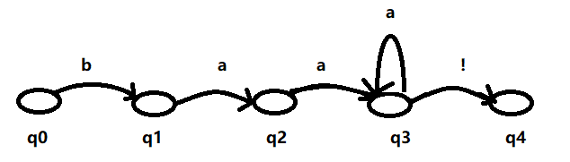
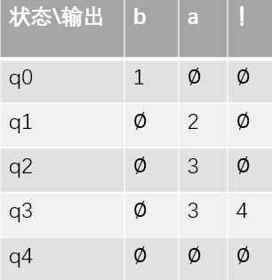
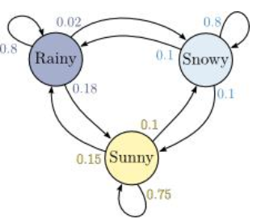
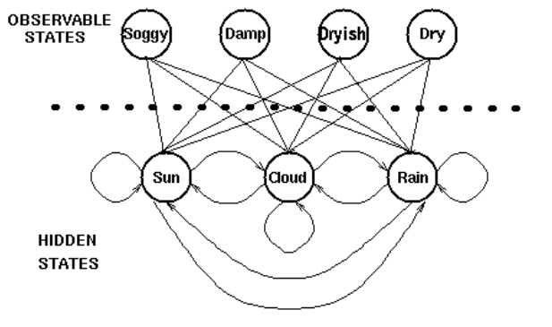
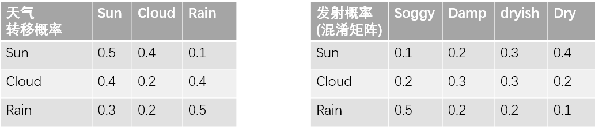
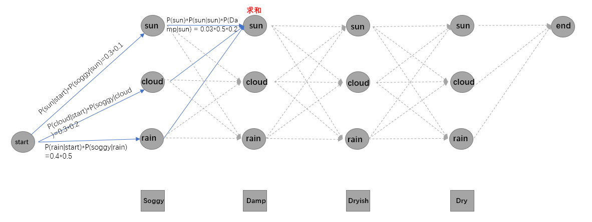
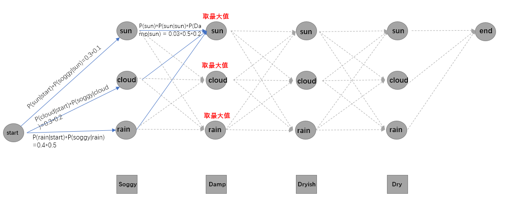
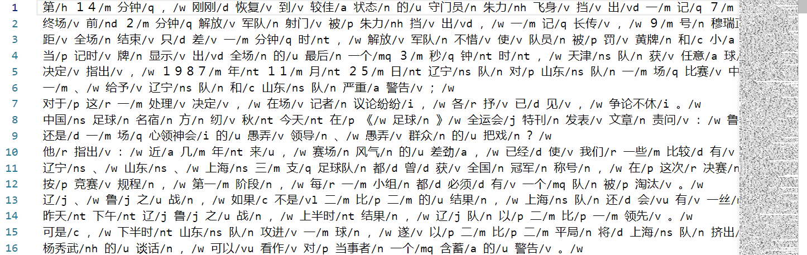

# 隐马尔可夫

## 目标

1. 知道什么是自动机
2. 知道什么是马尔可夫链
3. 知道隐马尔可夫是什么
4. 知道隐马尔可夫的原理是什么
5. 知道如何使用隐马尔可夫完成分词，词性标注等任务
6. 知道MEMM是什么
7. 知道CRF是什么


## 1. 自动机

自动机：（又称为 有限自动机，有限状态自动机，FSA）是表示有限个状态以及在这些状态之间的转移和动作等行为的数学模型。

例如：

我们常用的正则表达式就是一种用来描述字符串出现字符的自动机。

假如我们有正则表达式：`baa+!`，表示的是ba后面有1个或这多个a，最后是一个感叹号。

我们可以把上述的自动机用图来展示，如下：




自动机从初始状态q0开始，反复进行下面的过程：找到第一个字母b，如果找到b那么进入到下一个状态，再去寻找下一个状态需要的字母，指导进行接收状态q4。

我们可以使用状态转移表来自动机：



上述的状态机我们也称为**确定的自动状态机DFSA**(例如红绿灯)，如果位于q3的循环在q2上，那么在q2状态下，看到a，他是不清楚要向那个地方进行转移的。所以把这种状态机成为**非确定的自动状态机 NFSA**，（比如天气）。

## 2. 马尔可夫链和马尔可夫假设

马尔可链是自动状态机的扩展版，是一种带权的自动状态机。权重在马尔可夫链中就是连接弧的概率。离开一个节点的所有的概率和为1。

用马尔可夫链描述天气的变化，如果使用图模型来描述的话，可以有下面的示例：



如果今天下雨，那么明天的天气会怎么样呢？

明天下雪的概率：0.02

明天下雨的概率：0.8

明天晴天的概率：0.18

上述的过程包含了概率上的一个重要假设：在一个**一阶马尔可夫链**中，一个特定状态的概率只和他的前一个状态是有关的：

**马尔可夫假设**：
$$
P(q_i|q_{i-1}\cdots q_1) = P(q_i|q_{i-1})
$$
如果是把马尔可夫应用于NLP的文本序列，那么他表示的就是**二元N-gram模型**


## 3. 隐马尔可夫模型

当我们要计算我们能够观察到的事件序列的概率的时候，马尔可夫链是很有用的。但是在很多情况下，我们感兴趣的概率是没有办法直接计算的。例如在**词性标注**的问题中，我们能够看到句子中的词，能够计算这个句子组合的概率。但是我们的目标是或者这个句子对应的词性的序列。这些词性序列是隐藏的，不能够直接被观察到，我们需要去推断隐藏的状态，这个时候我们就需要使用**隐马尔科夫模型（HMM）**。

隐马尔可夫模型可以使用以下内容来进行描述：

> $Q = q_1,q_2,\cdots q_N$  状态N的集合
>
> $A = a_{11},a_{12}，\cdots,a_{nn}​$  转移概率矩阵A。每一个转移概率$a_{ij}​$表示从状态i转移到状态j的概率，同时从某一个状态出发的转移概率和为1
>
> $O = O_1,O_2 \cdots O_n$ 观察到的序列T
>
> $B = b_i(O_i)​$  观察似然度，也叫做发射概率，表示从状态i得到观察$O_i​$的概率
>
> q_0,q_F  表示初始状态和终结状态


隐马尔可夫模型中，除了马尔可夫假设之外，还有另外一个假设，即输出独立性假设，即:

一个输出观察$O_i$的概率只和产生该观察的状态$q_i​$有关
$$
P(O_i|q_1,q_2\cdots q_T ，O_1,O_2 \cdots O_T) = P(O_i|q_i)
$$


在类似词性标注的问题中，我们需要做的事情，在含有n个单词的观察序列的所有可能的隐藏序列中找到一个概率最大的隐藏序列，写成公式如下(其中帽子符号$\hat{}$表示对正确序列的估计)：
$$
\hat{t}_n = \mathop{argmax}_{t_n}P(t_n|w_n)
$$


根据前面的两个概率假设，上述公式也可以写为：
$$
\begin{align}
\hat{t}_n &= \mathop{argmax}_{t_n}P(t_n|w_n) \\
&= \mathop{argmax}_{t_n}\frac{P(t_n,w_n)}{P(w_n)} \\
&= \mathop{argmax}_{t_n}P(t_n,w_n) \\
&= \mathop{argmax}_{t_n}\prod_{i=1}^{n} P(w_i|t_i)P(t_i|t_{i-1}) \\
&= \mathop{argmax}_{t_n}P(w_i|t_i)P(t_i|t_{i-1})
\end{align}
$$
上述的公式中包含两个概率：

1. 标记的 **转移概率**：$P(t_i|t_{i-1})​$

2. 单词的**似然度(likelihood)**:又称为发射概率，即在状态$t_i​$的情况下发现观测值为$w_i​$的概率。

   > 似然度：likelihood的中文翻译，表示可能性、概率的意思

转移概率的计算方法：通过极大似然估计(MLE)，通过现有的语料，直接计算即可：

即：状态从$t_{i-1}到t_i$的总数 除以$t_{i-1}$的总数
$$
P(t_i|t_{i-1}) = \frac{C(t_{i-1},t_i)}{C(t_{i-1})}
$$

> **极大似然估计**：是一种概率在统计学中的应用，是一种参数估计方法，说的是说的是已知某个随机样本满足某种概率分布，但是其中具体的参数不清楚，参数估计就是通过若干次试验，使用实验得出的概率作为样本的概率。

似然度概率的计算方法同理：
$$
P(w_i|t_i) = \frac{C(t_i,w_i)}{C(t_i)}
$$
即数据集中所有的$w_i为t_i$的样本数量 除以 该状态$t_i$的总数

### 3.1 马尔科夫模型中的三个问题：

1. 似然度问题，即对于给定的观察序列，计算其可能的概率
2. 解码问题：即对于给定的观察序列，找到概率最大的隐藏序列
3. 学习问题：给定样本，学习HMM中的参数A（转移概率）和B（观察似然度）

其中问题三：学习问题前面已经讲解，通过语料进行统计，通过极大似然估计就可以计算。

### 3.2 似然度问题：

传说海藻的能够预测天气，假如海藻有下面四种状态，天气有三种状态，那么现在我们知道一列海藻的状态`[Damp,Dryish,Dry,Soggy]`,那么我们想知道对应这四天的天气是什么样子的，需要如何计算？



要完成上述的问题，我们需要历史的数据，假设我们有如下的历史数据：

1. 第一天分别为[sun,cloud,Rain]的概率分别是[0.3,0.3,0.4]

2. 状态转移概率和发射概率如下

   


最简单的方式，我们可以计算满足要求`[Damp,Dryish,Dry,Soggy]`的所有的天气状态的概率，然后进行乘积，得到结果，那么我们需要计算$N^M​$次，其中M表示观测值的数量，N表示状态的数量

我们可以使用**向前算法**来代替上述呈指数级增长的概率计算方法。向前算法是一种动态规划的方法。其核心思想就是，在计算观察序列的概率的时候，通过一个中间值来存储其中间值，同时对于**中间状态的概率，使用  之前状态 乘 转移概率的求和计算得到**

> 动态规划：把多阶段决策过程的最优化问题转化为一系列单阶段的问题

其计算过程如下：




其计算过程的伪代码如下：

>1. 初始化
>
>   $\alpha_1(j) = \alpha_{0j}b_{j}(o_1)​$
>
>2. 递归
>
>   $\alpha_t(j) = \sum_{i=1}^N \alpha_{t-1}(i) a_{ij} b_{j}(o_{t})​$
>
>3. 结束
>
>   $P(O|\lambda) = \sum_{i=1}^N \alpha_{T}(i)\alpha_{iF}​$
>
>$其中\alpha_t表示中间概率，\alpha_{ij}表示转移概率，b_j(o_t)表示发射概率​$


### 3.3 解码问题

根据观察序列确定隐藏序列的过程称之为decoding(解码)，decoder(加码器)的任务就是发现最优隐藏序列



其实现过程如下：

1. 遍历所有的状态，根据初始状态的概率计算*观察序列对应的发射概率，得到第一次概率结果
2. 遍历从第二次到最后的时间步
3. 遍历所有的状态
4. 计算：前一次的概率结果\*转移概率\*发射概率，选择概率最大的隐藏状态作为当前的隐藏状态


## 案例

下面我们使用语料，使用HMM设计一个模型进行分词

语料github地址：<https://github.com/liwenzhu/corpusZh>

语料内容如下



其中词性标注的代码含义如下：

```txt
		n   普通名词
		nt  时间名词
		nd  方位名词
		nl  处所名词
		nh  人名
		nhf 姓
		nhs 名
		ns  地名
		nn  族名
		ni  机构名
		nz  其他专名
		v   动词
		vd  趋向动词
		vl  联系动词
		vu  能愿动词
		a   形容词
		f   区别词
		m   数词　　
		q   量词
		d   副词
		r   代词
		p   介词
		c   连词
		u   助词
		e   叹词
		o   拟声词
		i   习用语
		j   缩略语
		h   前接成分
		k   后接成分
		g   语素字
		x   非语素字
		w   标点符号
		ws  非汉字字符串
		wu  其他未知的符号
```

该语料可以用来训练分词模型，也可以用来训练词性标注等模型。

### 如何对句子进行分词

思考：

> 如果使用上述的语料进行分词，我们应该如何准备我们的数据

通常在分词过程中，每个字会对应一个符号，然后我们根据预测的符号对句子进行划分。

例如：我们有下列四种符号表示所有单字的状态

```txt
B  表示 begin 词语的开始
M  表示 middle 词语的中间
E  表示 end  词语的结束
S  表示 single 单个字成词
```

那么，会有下列情况

```pyhton
我/S爱/S北/B京/E天/B安/M门/E
```

此时，我们把所有的E和S分开，就能够实现对句子的分词了


### 统计概率

根据前面的知识，我们知道，为了计算解码过程中，每个时间步上的概率最大值，需要统计四个概率，分别是

1. 初始状态概率
2. 状态转移概率
3. 发射概率
4. 结束状态概率

根据极大似然估计的思想，我们通过统计语料，可以得到上述概率

我们的思路如下：

1. 定义保存概率的容器
2. 对每个句子进行处理
3. 对每个句子中的字进行统计
4. 保存概率后续使用

我们可以定义一个对象， 来进行概率的统计

```python
class ProbilityMartix:
    def __init__(self):
        self.state_list = ["B","M","E","S"] #初始的四种状态
        self.state_num = len(self.state_list)

        #初始概率向量 {B:200，S:400}
        self.PiVector = {i:0 for i in self.state_list}
        #总的句子数，或者是总得初始向量
        self.PiVector_size = 0

        #转移概率矩阵，从一个状态到另一个状态的数量 {B:{E:100,S:200...}}
        self.TransProbMatrix = {i:{j:0 for j in self.state_list} for i in self.state_list }
        #每个状态的总数，上面的/下面的 = 从一个状态到另一个状态的概率 {S:200,E:300}
        self.TransProbMatrix_size = {i:0 for i in self.state_list}

        #发射概率矩阵，从状态到词的数量，【后续求当前这个词到位某个状态的数量/ 状态的数量= 某个词为某个状态的概率】
        self.EmitProbMartix = {i:{} for i in self.state_list}
        #每个状态数量 {"S"：100}
        self.EmitProbMartix_word_size = {}
        
        self.EndProbMartix = {i:0 for i in self.state_list}
        self.EndProbMartix_size = 0
        

```

之后，对每个句子进行处理和统计

```python
   def sentence2states(self,sentence):
        '''
        :param sentence:['明日', '将', '与', '河北', '队', '作', '赛', '津', '队', '在', '实力', '上', '稍胜一筹', '可望', '取胜']
        :return: ["BE"，"S","S"....]
        '''
        state_output = []
        for word in sentence:
            word = word.strip()
            if len(word)<1:
                continue
            current_state = ""
            if len(word) ==1:
                current_state += "S"
            elif len(word)>1:
                M_num = len(word)-2
                current_state += "B"
                current_state += "M"*M_num
                current_state += "E"
            state_output.append(current_state)
        return state_output

    def start_count_by_sentence(self,sentence):
        states = self.sentence2states(sentence)

        #把词和状态链接到一起，方便后面统计
        joined_sentence = "".join(sentence) #明日将与河北'
        joined_states = "".join(states) #"BESSBE"
        
         #统计初始数量
        self.PiVector[joined_states[0]] +=1
        #统计初始总数
        self.PiVector_size+=1
        
        for i in range(len(joined_states)-1):
            #统计转移状态的数量
            self.TransProbMatrix[joined_states[i]][joined_states[i+1]] +=1
            #统计状态的数量
            self.TransProbMatrix_size[joined_states[i]] +=1

        for i in range(len(joined_states)):
            #统计发射词的数量
            if joined_sentence[i] in self.EmitProbMartix[joined_states[i]]:
                self.EmitProbMartix[joined_states[i]][joined_sentence[i]] +=1
            else:
                self.EmitProbMartix[joined_states[i]][joined_sentence[i]]=1

            #统计不同词的总数,应该是统计所有的状态
            if joined_states[i] in self.EmitProbMartix_word_size:
                self.EmitProbMartix_word_size[joined_states[i]] += 1
            else:
                self.EmitProbMartix_word_size[joined_states[i]] = 1
        #统计结束的概率
        last_state = joined_states[-1]
        self.EndProbMartix[last_state] += 1
        self.EndProbMartix_size += 1

```

之后进行计算和保存

```python
def get_probility(self):
        '''
        开始计算概率
        :return:
        '''
        self.PiVector_prob = deepcopy(self.PiVector)
        self.TransProbMatrix_prob = deepcopy(self.TransProbMatrix)
        self.EmitProbMartix_prob = deepcopy(self.EmitProbMartix)

        for key in self.PiVector_prob:
            self.PiVector_prob[key] = np.log((self.PiVector_prob[key]/self.PiVector_size))
        for start in self.TransProbMatrix_prob:
            for end in self.TransProbMatrix_prob[start]:
                #避免算出来为0
                self.TransProbMatrix_prob[start][end] = 1 if self.TransProbMatrix_prob[start][end]==0 else self.TransProbMatrix_prob[start][end]

                self.TransProbMatrix_prob[start][end] = np.log((self.TransProbMatrix_prob[start][end]/self.TransProbMatrix_size[start]))

        #后续再使用的时候，没有出现的词让其概率低
        for key in self.EmitProbMartix_prob:
            for word in self.EmitProbMartix_prob[key]:
                self.EmitProbMartix_prob[key][word] = np.log((self.EmitProbMartix_prob[key][word]/self.EmitProbMartix_word_size[key]))
        
         #统计结束概率
        for key in self.EndProbMartix_prob:
            self.EndProbMartix_prob[key] = np.log(self.EndProbMartix_prob[key]/self.EndProbMartix_size)

    def save_probility(self):
        temp = {
            "EmitProbMartix_prob" : self.EmitProbMartix_prob,
            "PiVector_prob":self.PiVector_prob,
            "TransProbMatrix_prob":self.TransProbMatrix_prob,
            "EndProbMatrix_prob": self.EndProbMartix_prob
        }
        with open("./probility.pkl","wb") as f:
            pickle.dump(temp,f)

    def run(self):
        file_path = r"corpusZH-master/all.txt"
        for sentence in prepar_sentences(file_path):
            self.start_count_by_sentence(sentence)

        self.get_probility()
        self.save_probility()
```

### 使用viterbi算法进行解码

使用viterbi算法实现分词的部分代码实现如下：

```python
    def start_calcute(self,sentence):
        '''
        通过viterbi算法计算结果
        :param sentence: "小明硕士毕业于中国科学院计算所"
        :return: "S...E"
        '''
        zero = -3.14e+100
        zero_log = np.log(-3.14e+100)
        init_state = self.prob_dict["PiVector_prob"]
        trans_prob = self.prob_dict["TransProbMatrix_prob"]
        emit_prob = self.prob_dict["EmitProbMartix_prob"]
        end_prob = self.prob_dict["EndProbMatrix_prob"]

        V = [{}] #其中的字典保存 每个时间步上的每个状态对应的概率
        path = {}

        #初始概率
        for y in self.state_list:
            V[0][y] = init_state[y] + emit_prob[y].get(sentence[0],zero_log)
            path[y] = [y]
		
        #从第二次到最后一个时间步
        for t in range(1,len(sentence)):
            V.append({})
            newpath = {}
            for y in self.state_list: #遍历所有的当前状态
                    temp_state_prob_list = []
                    for y0 in self.state_list: #遍历所有的前一次状态
                        cur_prob = V[t-1][y0]+trans_prob[y0][y]+emit_prob[y].get(sentence[t],zero_log)
                        temp_state_prob_list.append([cur_prob,y0])
					#取最大值，作为当前时间步的概率
                    prob,state =  sorted(temp_state_prob_list,key=lambda x:x[0],reverse=True)[0]
                    #保存当前时间步，当前状态的概率
                    V[t][y] = prob
                    #保存当前的状态到newpath中
                    newpath[y] = path[state] + [y]
			#让path为新建的newpath
            path = newpath

        #输出的最后一个结果只会是S（表示单个字）或者E（表示结束符）
        (prob, state) = max([(V[len(sentence)][y]+end_prob[y], y) for y in ["S","E"]])
        return (prob, path[state])
```


